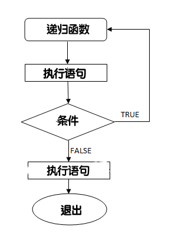

[TOC]


# C语言初阶学习

---

## 第一个程序

```c
#include <stdio.h>//输入输出头文件

int main(){
  printf("This is my first C code programe\n");//分号结尾
  // 第一个C语言程序
  return 0;
}
```

---

## 数据存储数值的大小

### INT 类型在当前电脑中存储大小

```c
#include <stdio.h>
#include <limits.h>

int main(){
  printf("int 存储的大小： %lu \n", sizeof(int));
  return 0;
}
```

---

### FLOAT浮点型变量在当前电脑中存储大小

```c
#include <stdio.h>
#include <float.h>

int main(){
 printf("float 存储最大字节数 : %lu \n", sizeof(float));
 printf("float 最小值: %E\n", FLT_MIN );
 printf("float 最大值: %E\n", FLT_MAX );
 printf("精度值: %d\n", FLT_DIG );
 
 return 0;
}
```

---

## 关于ASCII码

```c
#include <stdio.h>

int main (){
  char a = 'a';
  int Asc_a = (int)a;
  char Rev_Asc_a = (char)Asc_a;
  printf ("Asc_a : %d\nRev_Asc_a: %c", Asc_a, Rev_Asc_a);
  return 0;
}
```

---

##  强制转换

```c
#include <stdio.h>

int main (){
  float num = 2.333;
  printf ("this is a num by type INT : %d", (int)num);
  return 0;
}
```

---

## 常量的两种定义方式

### ==#Define 与 const==

```c
#include <stdio.h>
#include <string.h>

#define a 10 //定义方法定义常量不需要加等号，也无需说明变量的类型 最重要的一点是没有分号结束语句
#define b "This is a test"
#define c 'a'
const int a1 = 20; //用const定义常量的时候 如extern声明外部变量一样，需要说明变量类型，要用等号而且要加分号结束语句
const char b1[] = "another test";
const char c1 = 'b';
int main (){
  printf("a + a1 = %d\n b + b1 = %s\n c + c1 = %c", a + a1, b, c);
  return 0;
}

// 这里我做的并不规范， 正常的习惯是 把常量名称都写为==大写==
//通常情况下，建议使用 const 关键字来定义常量，因为它具有类型检查和作用域的优势，而 #define 仅进行简单的文本替换，可能会导致一些意外的问题。
```

---

## C的存储类

### auto存储类

* ==auto==存储类是所有局部变量的==默认==存储类

```c
{
 int mount;
 auto int month;
}
```

> 上面的实例定义了两个带有相同存储类的变量，auto 只能用在函数内，即 auto 只能修饰局部变量

### register存储类

```c
{
 register int  miles;
}
```

* **register** 存储类用于定义存储在==寄存器==中而不是 RAM 中的局部变量。这意味着变量的最大尺寸等于寄存器的大小（通常是一个字），且不能对它应用一元的 '&' 运算符（因为它没有内存位置）。

* register 存储类定义存储在寄存器，所以变量的访问速度更快，但是它不能直接取地址，因为它不是存储在 RAM 中的。==在需要频繁访问的变量上使用 register 存储类可以提高程序的运行速度。==

### ==static 存储类==

* **static** 存储类指示编译器在程序的生命周期内保持局部变量的存在，而不需要在每次它进入和离开作用域时进行创建和销毁。因此，使用 static 修饰局部变量可以在函数调用之间保持局部变量的值。

* static 修饰符也可以应用于全局变量。当 static 修饰全局变量时，会使变量的作用域限制在声明它的文件内。

* 全局声明的一个 static 变量或方法可以被任何函数或方法调用，只要这些方法出现在跟 static 变量或方法同一个文件中。

* 静态变量在程序中只被初始化一次，即使函数被调用多次，该变量的值也不会重置。

* 以下实例演示了 static 修饰全局变量和局部变量的应用：

```c
#include <stdio.h>

/* 函数声明 */
void func1(void);

static int count = 10;        /* 全局变量 - static 是默认的 */

int main()
{
while (count--) {
    func1();
}
return 0;
}

void func1(void)
{
/* 'thingy' 是 'func1' 的局部变量 - 只初始化一次
* 每次调用函数 'func1' 'thingy' 值不会被重置。
*/                
static int thingy=5;
thingy++;
printf(" thingy 为 %d ， count 为 %d\n", thingy, count);
}
```

### extern 存储类

* **extern** 存储类用于定义在==其他文件==中声明的==全局变量或函数==。当使用 extern 关键字时，不会为变量分配任何存储空间，而只是指示编译器该变量在其他文件中定义。

* **extern** 存储类用于提供一个全局变量的引用，全局变量对所有的程序文件都是可见的。当您使用 **extern** 时，对于无法初始化的变量，会把变量名指向一个之前定义过的存储位置。

* 当您有多个文件且定义了一个可以在其他文件中使用的全局变量或函数时，可以在其他文件中使用 *extern* 来得到已定义的变量或函数的引用。可以这么理解，*extern* 是用来在另一个文件中声明一个全局变量或函数。

* extern 修饰符通常用于当有两个或多个文件共享相同的全局变量或函数的时候，如下所示：

* **第一个文件：main.c**

```c
#include <stdio.h>

int count ;
extern void write_extern();

int main()
{
 count = 5;
 write_extern();
}
```

* **第二个文件：support.c**

```c
#include <stdio.h>

extern int count;

void write_extern(void)
{
 printf("count is %d\n", count);
}
```

* 在这里，第二个文件中的 *extern* 关键字用于声明已经在第一个文件 main.c 中定义的 *count*。现在 ，编译这两个文件，如下所示：

```
$ gcc main.c support.c
```

* 这会产生 **a.out** 可执行程序，当程序被执行时，它会产生下列结果：

```
count is 5
```

---

## C的运算符

* 算数运算符
* 关系运算符
* 逻辑运算符
* 位运算符
* 赋值运算符
* 杂项运算符

### 算数运算符

* 下表显示了 C 语言支持的所有算术运算符。假设变量 **A** 的值为 10，变量 **B** 的值为 20，则：

| 运算符 |               描述               |       实例       |
| :----: | :------------------------------: | :--------------: |
|   +    |         把两个操作数相加         | A + B 将得到 30  |
|   -    | 从第一个操作数中减去第二个操作数 | A - B 将得到 -10 |
|   *    |         把两个操作数相乘         | A * B 将得到 200 |
|   /    |           分子除以分母           |  B / A 将得到 2  |
|   %    |     取模运算符，整除后的余数     |  B % A 将得到 0  |
|   ++   |     自增运算符，整数值增加 1     |  A++ 将得到 11   |
|   --   |     自减运算符，整数值减少 1     |   A-- 将得到 9   |

> **注意** 如果a = 10, c = a++ 则先进行c = a的操作，然后再执行a自加的操作
>
> 如果 a = 10, c = ++a 则先进行a自加的操作，然后再进行c = a的赋值操作

### 关系运算符

* 下表显示了 C 语言支持的所有关系运算符。假设变量 **A** 的值为 10，变量 **B** 的值为 20，则：

| 运算符 |                             描述                             |      实例       |
| :----: | :----------------------------------------------------------: | :-------------: |
|   ==   |       检查两个操作数的值是否相等，如果相等则条件为真。       | (A == B) 为假。 |
|   !=   |      检查两个操作数的值是否相等，如果不相等则条件为真。      | (A != B) 为真。 |
|   >    |   检查左操作数的值是否大于右操作数的值，如果是则条件为真。   | (A > B) 为假。  |
|   <    |   检查左操作数的值是否小于右操作数的值，如果是则条件为真。   | (A < B) 为真。  |
|   >=   | 检查左操作数的值是否大于或等于右操作数的值，如果是则条件为真。 | (A >= B) 为假。 |
|   <=   | 检查左操作数的值是否小于或等于右操作数的值，如果是则条件为真。 | (A <= B) 为真。 |

### 逻辑运算符

* 下表显示了 C 语言支持的所有关系逻辑运算符。假设变量 **A** 的值为 1，变量 **B** 的值为 0，则：

| 运算符 |                             描述                             |       实例        |
| :----: | :----------------------------------------------------------: | :---------------: |
|   &&   |   称为==逻辑与==运算符。如果两个操作数都非零，则条件为真。   |  (A && B) 为假。  |
|  \|\|  | 称为==逻辑或==运算符。如果两个操作数中有任意一个非零，则条件为真。 | (A \|\| B) 为真。 |
|   !    | 称为==逻辑非==运算符。用来逆转操作数的逻辑状态。如果条件为真则逻辑非运算符将使其为假。 | !(A && B) 为真。  |

### ==位运算符==

* 位运算符作用于位，并逐位执行操作。&、 | 和 ^ 的真值表如下所示：

|  p   |  q   | p & q | p \| q | p ^ q |
| :--: | :--: | :---: | :----: | :---: |
|  0   |  0   |   0   |   0    |   0   |
|  0   |  1   |   0   |   1    |   1   |
|  1   |  1   |   1   |   1    |   0   |
|  1   |  0   |   0   |   1    |   1   |


* 下表显示了 C 语言支持的位运算符。假设变量 **A** 的值为 60，变量 **B** 的值为 13，则：

| 运算符 |                             描述                             |                             实例                             |
| :----: | :----------------------------------------------------------: | :----------------------------------------------------------: |
|   &    | 对两个操作数的每一位执行逻辑与操作，如果两个相应的位都为 1，则结果为 1，否则为 0。按位与操作，按二进制位进行"与"运算。运算规则：`0&0=0;    0&1=0;     1&0=0;      1&1=1;` |              (A & B) 将得到 12，即为 0000 1100               |
|   \|   | 对两个操作数的每一位执行逻辑或操作，如果两个相应的位都为 0，则结果为 0，否则为 1。按位或运算符，按二进制位进行"或"运算。运算规则：`0|0=0;    0|1=1;    1|0=1;     1|1=1;` |              (A \| B) 将得到 61，即为 0011 1101              |
|   ^    | 对两个操作数的每一位执行逻辑异或操作，如果两个相应的位值相同，则结果为 0，否则为 1。异或运算符，按二进制位进行"异或"运算。运算规则：`0^0=0;    0^1=1;    1^0=1;   1^1=0;` |              (A ^ B) 将得到 49，即为 0011 0001               |
|   ~    | 对操作数的每一位执行逻辑取反操作，即将每一位的 0 变为 1，1 变为 0。取反运算符，按二进制位进行"取反"运算。运算规则：`~1=-2;    ~0=-1;` | (~A ) 将得到 -61，即为 1100 0011，一个有符号二进制数的补码形式。 |
|   <<   | 将操作数的所有位向左移动指定的位数。左移 n 位相当于==乘以 2 的 n 次方==。二进制左移运算符。将一个运算对象的各二进制位全部左移若干位（左边的二进制位丢弃，右边补0）。 |              A << 2 将得到 240，即为 1111 0000               |
|   >>   | 将操作数的所有位向右移动指定的位数。右移n位相当于==除以 2 的 n 次方==。二进制右移运算符。将一个数的各二进制位全部右移若干位，正数左补 0，负数左补 1，右边丢弃。 |               A >> 2 将得到 15，即为 0000 1111               |

### 赋值运算符

* 下表列出了 C 语言支持的赋值运算符：

| 运算符 |                             描述                             |              实例               |
| :----: | :----------------------------------------------------------: | :-----------------------------: |
|   =    |       简单的赋值运算符，把右边操作数的值赋给左边操作数       | C = A + B 将把 A + B 的值赋给 C |
|   +=   | 加且赋值运算符，把右边操作数加上左边操作数的结果赋值给左边操作数 |     C += A 相当于 C = C + A     |
|   -=   | 减且赋值运算符，把左边操作数减去右边操作数的结果赋值给左边操作数 |     C -= A 相当于 C = C - A     |
|   *=   | 乘且赋值运算符，把右边操作数乘以左边操作数的结果赋值给左边操作数 |     C *= A 相当于 C = C * A     |
|   /=   | 除且赋值运算符，把左边操作数除以右边操作数的结果赋值给左边操作数 |     C /= A 相当于 C = C / A     |
|   %=   |      求模且赋值运算符，求两个操作数的模赋值给左边操作数      |     C %= A 相当于 C = C % A     |
|  <<=   |                       左移且赋值运算符                       |    C <<= 2 等同于 C = C << 2    |
|  >>=   |                       右移且赋值运算符                       |    C >>= 2 等同于 C = C >> 2    |
|   &=   |                      按位与且赋值运算符                      |     C &= 2 等同于 C = C & 2     |
|   ^=   |                     按位异或且赋值运算符                     |     C ^= 2 等同于 C = C ^ 2     |
|  \|=   |                      按位或且赋值运算符                      |    C \|= 2 等同于 C = C \| 2    |

### 杂项运算符 ↦ sizeof & 三元

* 下表列出了 C 语言支持的其他一些重要的运算符，包括 **sizeof** 和 **? :**。

|  运算符  |       描述       |                 实例                 |
| :------: | :--------------: | :----------------------------------: |
| sizeof() | 返回变量的大小。 | sizeof(a) 将返回 4，其中 a 是整数。  |
|    &     | 返回变量的地址。 |      &a; 将给出变量的实际地址。      |
|    *     |  指向一个变量。  |         *a; 将指向一个变量。         |
|   ? :    |    条件表达式    | 如果条件为真 ? 则值为 X : 否则值为 Y |

### C运算符的优先级

* 下表将按运算符优先级从高到低列出各个运算符，具有较高优先级的运算符出现在表格的上面，具有较低优先级的运算符出现在表格的下面。在表达式中，较高优先级的运算符会优先被计算。

|    类别    |              运算符               |  结合性  |
| :--------: | :-------------------------------: | :------: |
|    后缀    |         () [] -> . ++ - -         | 从左到右 |
|    一元    |  + - ! ~ ++ - - (type)* & sizeof  | 从右到左 |
|    乘除    |               * / %               | 从左到右 |
|    加减    |                + -                | 从左到右 |
|    移位    |               << >>               | 从左到右 |
|    关系    |             < <= > >=             | 从左到右 |
|    相等    |               == !=               | 从左到右 |
|  位与 AND  |                 &                 | 从左到右 |
| 位异或 XOR |                 ^                 | 从左到右 |
|  位或 OR   |                \|                 | 从左到右 |
| 逻辑与 AND |                &&                 | 从左到右 |
| 逻辑或 OR  |               \|\|               | 从左到右 |
|    条件    |                ?:                 | 从右到左 |
|    赋值    | = += -= *= /= %=>>= <<= &= ^= \|= | 从右到左 |
|    逗号    |                 ,                 | 从左到右 |

---

## C中的判断


### 判断语句

|       语句       |                             描述                             |
| :--------------: | :----------------------------------------------------------: |
|     if 语句      |  一个 **if 语句** 由一个布尔表达式后跟一个或多个语句组成。   |
|  if...else 语句  | 一个 **if 语句** 后可跟一个可选的 **else 语句**，else 语句在布尔表达式为假时执行。 |
|   嵌套 if 语句   | 您可以在一个 **if** 或 **else if** 语句内使用另一个 **if** 或 **else if** 语句。 |
|   switch 语句    |   一个 **switch** 语句允许测试一个变量等于多个值时的情况。   |
| 嵌套 switch 语句 |  您可以在一个 **switch** 语句内使用另一个 **switch** 语句。  |

#### if语句

* 一个 **if 语句** 由一个布尔表达式后跟一个或多个语句组成。

```c
if(boolean_expression)
{
   /* 如果布尔表达式为真将执行的语句 */
}
```

#### if...else语句

```c
if(boolean_expression)
{
 /* 如果布尔表达式为真将执行的语句 */
}
else
{
 /* 如果布尔表达式为假将执行的语句 */
}
```

#### 嵌套 if 语句

```c

if( boolean_expression 1)
{
   /* 当布尔表达式 1 为真时执行 */
   if(boolean_expression 2)
   {
      /* 当布尔表达式 2 为真时执行 */
   }
}

```


#### ==switch 语句==

* 一个 **switch** 语句允许测试一个变量等于多个值时的情况。每个值称为一个 case，且被测试的变量会对每个 **switch case** 进行检查。

```c
switch(expression){
    case constant-expression  :
       statement(s);
       break; /* 可选的 */
    case constant-expression  :
       statement(s);
       break; /* 可选的 */
  
    /* 您可以有任意数量的 case 语句 */
    default : /* 可选的 */
       statement(s);
}
```

- **switch** 语句必须遵循下面的规则：

- **switch** 语句中的 **expression** 是一个常量表达式，必须是一个整型或枚举类型。

- ==在一个 switch 中可以有任意数量的 case 语句。每个 case 后跟一个要比较的值和一个冒号。==

- case 的 **constant-expression** 必须与 switch 中的变量具有相同的数据类型，且必须是一个常量或字面量。

- 当被测试的变量等于 case 中的常量时，case 后跟的语句将被执行，直到遇到 **break** 语句为止。

- 当遇到 **break** 语句时，switch 终止，控制流将跳转到 switch 语句后的下一行。

- 不是每一个 case 都需要包含 **break**。如果 case 语句不包含 **break**，控制流将会 *继续* 后续的 case，直到遇到 break 为止。

- 一个 **switch** 语句可以有一个可选的 **default** case，出现在 switch 的结尾。default case 可用于在上面所有 case 都不为真时执行一个任务。default case 中的 **break** 语句不是必需的。

- 

- ```c
    #include <stdio.h>
     
    int main ()
    {
       /* 局部变量定义 */
       char grade = 'B';
     
       switch(grade)
       {
       case 'A' :
          printf("很棒！\n" );
          break;
       case 'B' :
       case 'C' :
          printf("做得好\n" );
          break;
       case 'D' :
          printf("您通过了\n" );
          break;
       case 'F' :
          printf("最好再试一下\n" );
          break;
       default :
          printf("无效的成绩\n" );
       }
       printf("您的成绩是 %c\n", grade );
     
       return 0;
    ```

    

#### 嵌套 switch 语句

* C 语言中 **嵌套 switch** 语句的语法：

```c
switch(ch1) {
   case 'A': 
      printf("这个 A 是外部 switch 的一部分" );
      switch(ch2) {
         case 'A':
            printf("这个 A 是内部 switch 的一部分" );
            break;
         case 'B': /* 内部 B case 代码 */
      }
      break;
   case 'B': /* 外部 B case 代码 */
}
```

* 例子：

```c
#include <stdio.h>
 
int main ()
{
   /* 局部变量定义 */
   int a = 100;
   int b = 200;
 
   switch(a) {
      case 100: 
         printf("这是外部 switch 的一部分\n");
         switch(b) {
            case 200:
               printf("这是内部 switch 的一部分\n");
         }
   }
   printf("a 的准确值是 %d\n", a );
   printf("b 的准确值是 %d\n", b );
 
   return 0;
}
```


---

## C循环


### 循环类型

* C 语言提供了以下几种循环类型。点击链接查看每个类型的细节。

|    循环类型     |                             描述                             |
| :-------------: | :----------------------------------------------------------: |
|   while 循环    | 当给定条件为真时，重复语句或语句组。它会在执行循环主体之前测试条件。 |
|    for 循环     |        多次执行一个语句序列，简化管理循环变量的代码。        |
| do...while 循环 |  除了它是在循环主体结尾测试条件外，其他与 while 语句类似。   |
|    嵌套循环     | 您可以在 while、for 或 do..while 循环内使用一个或多个循环。  |

#### while循环

```c
#include <stdio.h>
 
int main ()
{
   /* 局部变量定义 */
   int a = 10;

   /* while 循环执行 */
   while( a < 20 )
   {
      printf("a 的值： %d\n", a);
      a++;
   }
 
   return 0;
}
```

#### for 循环

* for循环的语法：

```c
for ( init; condition; increment )
{
   statement(s);
}
```

for循环的解释：

1. **init** 会首先被执行，且只会执行一次。这一步允许您声明并初始化任何循环控制变量。您也可以不在这里写任何语句，只要有一个分号出现即可。
2. 接下来，会判断 **condition**。如果为真，则执行循环主体。如果为假，则不执行循环主体，且控制流会跳转到紧接着 for 循环的下一条语句。
3. 在执行完 for 循环主体后，控制流会跳回上面的 **increment** 语句。该语句允许您更新循环控制变量。该语句可以留空，只要在条件后有一个分号出现即可。
4. 条件再次被判断。如果为真，则执行循环，这个过程会不断重复（循环主体，然后增加步值，再然后重新判断条件）。在条件变为假时，for 循环终止。

例子：

```c
#include <stdio.h>
 
int main ()
{
   /* for 循环执行 */
   for( int a = 10; a < 20; a = a + 1 )
   {
      printf("a 的值： %d\n", a);
   }
 
   return 0;
}
```

#### do...while循环

* 循环语法：

```c
do
{
   statement(s);

}while( condition );

```

### 循环控制语句

|   控制语句    |                             描述                             |
| :-----------: | :----------------------------------------------------------: |
|  break 语句   | 终止**循环**或 **switch** 语句，程序流将继续执行紧接着循环或 switch 的下一条语句。 |
| continue 语句 |  告诉一个循环体立刻停止本次循环迭代，重新开始下次循环迭代。  |
|   goto 语句   | 将控制转移到被标记的语句。但是不建议在程序中使用 goto 语句。 |

---

## C函数

### 函数的定义

* 函数定义的形式

```c
return_type function_name( parameter list )
{
   body of the function
}

```

在 C 语言中，函数由一个函数头和一个函数主体组成。下面列出一个函数的所有组成部分：

- **返回类型：**一个函数可以返回一个值。**return_type** 是函数返回的值的数据类型。有些函数执行所需的操作而不返回值，在这种情况下，return_type 是关键字 **void**。
- **函数名称：**这是函数的实际名称。函数名和参数列表一起构成了函数签名。
- **参数：**参数就像是占位符。当函数被调用时，您向参数传递一个值，这个值被称为实际参数。参数列表包括函数参数的类型、顺序、数量。参数是可选的，也就是说，函数可能不包含参数。
- **函数主体：**函数主体包含一组定义函数执行任务的语句。

### 函数的参数

* 如果函数要使用参数，则必须声明接受参数值的变量。这些变量称为函数的**形式参数**。

* 形式参数就像函数内的其他局部变量，在进入函数时被创建，退出函数时被销毁。

* 当调用函数时，有两种向函数传递参数的方式：

|                           调用类型                           |                             描述                             |
| :----------------------------------------------------------: | :----------------------------------------------------------: |
| [传值调用](https://www.runoob.com/cprogramming/c-function-call-by-value.html) | 该方法把参数的实际值复制给函数的形式参数。在这种情况下，修改函数内的形式参数不会影响实际参数。 |
| [引用调用](https://www.runoob.com/cprogramming/c-function-call-by-pointer.html) | 通过指针传递方式，形参为指向实参地址的指针，当对形参的指向操作时，就相当于对实参本身进行的操作。 |

* 默认情况下，C 使用**传值调用**来传递参数。一般来说，这意味着函数内的代码不能改变用于调用函数的实际参数。

---

## C作用域的规则

### C语言声明变量的三个位置

1. 在==函数==或==块内部==的==局部变量==
2. 在==所有函数外部==的==全局变量==
3. 在==形式参数的函数参数==定义中

> 在程序中，局部变量和全局变量的名称可以相同，但是在函数内，==如果两个名字相同，会使用局部变量值，全局变量不会被使用。==

### 全局变量与局部变量在内存中的区别

- 全局变量保存在内存的全局存储区中，占用静态的存储单元；
- 局部变量保存在栈中，只有在所在函数被调用时才动态地为变量分配存储单元。

### 初始化局部变量和全局变量

* 当局部变量被定义时，系统不会对其初始化，您必须自行对其初始化。定义全局变量时，系统会自动对其初始化，如下所示：

| 数据类型 | 初始化默认值 |
| :------: | :----------: |
|   int    |      0       |
|   char   |     '\0'     |
|  float   |      0       |
|  double  |      0       |
| pointer  |     NULL     |

---

## C数组


### 数组的声明

在C中如果要声明一个数组，需要制定元素的类型和元素的数量

`type arrayName [ arraySize ];`

* 👆是一维数组。**arraySize**必须是一个大于零的整数常量
* **type**可以是任意有效的C数据类型。

> 例如要声明一个类型为**double**的包含**10**个元素的数组**balance**
>
> `double balance[10]`

### 数组的初始化

1. 逐个初始化数组：

```c
double balance[5] = {1000.0, 2.0, 3.4, 7.0, 50.0}
```

> 大括号内的变量数目不能大于[]内的元素数目

2. 我们也可以省略[]内的数字，此时数组的大小为初始化元素的个数

```c
double balance[] = {1000.0, 2.0, 3.4, 7.0, 50.0}
```

3. 为数组中具体某个元素赋值

```c
balance[4] = 50.0
```

### 获取数组长度

```c
#include <stdio.h>

int main() {
    int array[] = {1, 2, 3, 4, 5};
    int length = sizeof(array) / sizeof(array[0]);
//数组的占内存的总位数与数组中单个元素所占内存位数的商即为数组的长度
    printf("数组长度为: %d\n", length);

    return 0;
}
```

### 数组名

> 在C语言中，==数组名表示数组的地址==，即数组首元素的地址。

```c
int myArray[5] = {10, 20, 30, 40, 50};
//在⬆️代码中，myArray为数组名，也是第一个元素的地址。
```

> 数组名本身是一个常量指针，意味着他的值是==不能被改变的==，一旦确定，就不能再指向其他地方。
>
> 我们可以用==&==运算符来获取数组的地址。

```c
int myArray[5] = {10, 20, 30, 40, 50};
int *ptr = &myArray[0]; // 或者直接写作 int *ptr = myArray;
```

* 直接用数组名用于指针运算的例子：

```c
void printArray(int arr[], int size) {
    for (int i = 0; i < size; i++) {
        printf("%d ", arr[i]); // 数组名arr被当作指针使用
    }
}

int main() {
    int myArray[5] = {10, 20, 30, 40, 50};
    printArray(myArray, 5); // 将数组名传递给函数
    return 0;
}
```


### C数组详解

|        概念        |                             描述                             |
| :----------------: | :----------------------------------------------------------: |
|      多维数组      |       C 支持多维数组。多维数组最简单的形式是二维数组。       |
|   传递数组给函数   | 您可以通过指定不带索引的数组名称来给函数传递一个指向数组的指针。 |
|   从函数返回数组   |                    C 允许从函数返回数组。                    |
|   指向数组的指针   | 您可以通过指定不带索引的数组名称来生成一个指向数组中第一个元素的指针。 |
| 静态数组与动态数组 | 态数组在编译时分配内存，大小固定，而动态数组在运行时手动分配内存，大小可变。 |

#### 多维数组

##### 多维数组的声明

```c
type name[size1][size2]...[sizeN];
```

##### 最简单多维数组 --- 二维数组

```c
type arrayName [ x ][ y ];
```

> 其中，**type** 可以是任意有效的 C 数据类型，**arrayName** 是一个有效的 C 标识符。一个二维数组可以被认为是一个带有 x 行和 y 列的表格。下面是一个二维数组，包含 3 行和 4 列：

```c
int x[3][4];
```

##### 二维数组的初始化

* 多维数组可以通过在括号内为每行指定值来进行初始化。下面是一个带有 3 行 4 列的数组。

```c
int a[3][4] = {  
 {0, 1, 2, 3} ,   /*  初始化索引号为 0 的行 */
 {4, 5, 6, 7} ,   /*  初始化索引号为 1 的行 */
 {8, 9, 10, 11}   /*  初始化索引号为 2 的行 */
};
/*------------第二种方式----------*/
int a[3][4] = {0,1,2,3,4,5,6,7,8,9,10,11};

```

#### C传递数组给函数

1. 形式参数是一个指针：

    ```c
    void myFunction(int *param)
    {
    .
    .
    .
    }
    ```

    

2. 形式参数是一个已经定义大小的数组：

    ```c
    void myFunction(int param[10])
    {
    .
    .
    .
    }
    ```

3. 形式参数是一个为定义大小的数组：

    ```c
    void myFunction(int param[])
    {
    .
    .
    .
    }
    ```

#### C从函数返回数组

* C 语言不允许返回一个完整的数组作为函数的参数。但是，可以通过指定不带索引的数组名来返回一个指向数组的指针

* 如果您想要从函数返回一个一维数组，必须声明一个返回指针的函数

```c
int* myFunction()
{
.
.
.
}
```

> C不支持在函数外返回局部变量的地址，除非定义局部变量为static变量

👇是一个例子，他会随机生成10个数，并使用数组来返回它们：

```c
#include <stdio.h>
#include <stdlib.h>
#include <time.h>
 
/* 要生成和返回随机数的函数 */
int* getRandom( )
{
  static int  r[10];
  int i;
 
  /* 设置种子 */
  srand( (unsigned)time( NULL ) );
  for ( i = 0; i < 10; ++i)
  {
     r[i] = rand();
     printf( "r[%d] = %d\n", i, r[i]);
 
  }
 
  return r;
}
 
/* 要调用上面定义函数的主函数 */
int main ()
{
   /* 一个指向整数的指针 */
   int *p;
   int i;
 
   p = getRandom();
   for ( i = 0; i < 10; i++ )
   {
       printf( "*(p + %d) : %d\n", i, *(p + i));
   }
 
   return 0;
}
```

#### 指向数组的指针

> ==组名本身是一个常量指针==，意味着它的值是==不可变==的，一旦确定，就不能再指向其他地方。

因此，在`double balance[50]`中，**balance**是一个指向&balance[0]的指针

> **==使用数组名作为常量指针是合法的，反之亦然。因此，*(balance + 4) 是一种访问 balance[4] 数据的合法方式。==**
>
> **==一旦您把第一个元素的地址存储在 p 中，您就可以使用 *p、*(p+1)、*(p+2) 等来访问数组元素==**

#### 静态数组与动态数组

* 静态数组：编译时分配内存，大小固定
* 动态数组：运行时手动分配内存，大小可变

> 静态数组的生命周期与作用域相关，而动态数组的生命周期由程序员控制。
>
> ==使用动态数组时，需要注意合理地分配和释放内存，以免内存泄漏和访问无效内存的问题==

##### 静态数组

静态数组是在编译时声明并分配内存空间的数组。

静态数组具有固定的大小，在声明数组时需要指定数组的长度。

静态数组的特点包括：

- 内存分配：在程序编译时，静态数组的内存空间就被分配好了，存储在栈上或者全局数据区。
- 大小固定：静态数组的大小在声明时确定，并且无法在运行时改变。
- 生命周期：静态数组的生命周期与其==作用域==相关。如果在函数内部声明静态数组，其生命周期为整个函数执行期间；如果在函数外部声明静态数组，其生命周期为整个程序的执行期间。

##### ==动态数组==

动态数组是在运行时通过动态内存分配函数（如==**malloc** 和 **calloc=**==）手动分配内存的数组。

动态数组特点如下：

- 内存分配：动态数组的内存空间在运行时通过动态内存分配函数手动分配，并存==储在堆==上。**需要使用 `malloc`、`calloc` 等函数来申请内存，并使用 `free` 函数来释放内存。**
- 大小可变：动态数组的大小在运行时可以根据需要进行调整。**可以使用 `realloc` 函数来重新分配内存，并改变数组的大小。**
- 生命周期：动态数组的生命周期由程序员控制。需要在使用完数组后手动释放内存，以避免内存泄漏。

动态数组的声明、内存分配和释放实例：

```c
#include <stdlib.h>
int size = 5;
int *dynamicArray = (int *)malloc(size * sizeof(int)); // 动态数组内存分配
// 使用动态数组
free(dynamicArray); // 动态数组内存释放
```

这样写也可以：

```c
int *array = malloc(size * sizeof(int));
```

> **在C中，通常不需要为`malloc`的返回值显式地进行类型转换，因为`void*`可以隐式地转换为其他指针类型。但在C++中，你必须显式地进行类型转换，因为C++不允许`void*`到其他指针类型的隐式转换。**
>
> **对于纯C代码，两种方式都是可以的，但不进行类型转换的方式更为简洁。然而，如果你的代码可能在C++编译器中编译，那么显式地进行类型转换是必要的。**

## ==enum（枚举）==

* 枚举是 C 语言中的一种基本数据类型，用于定义一组具有离散值的常量。，它可以让数据更简洁，更易读。

* 枚举类型通常用于为程序中的一组==相关的常量==取名字，以便于程序的可读性和维护性。

* 定义一个枚举类型，需要使用 ==**enum**== 关键字，后面跟着==枚举类型的名称==，以及用大括号==**{}**==括起来的一组枚举常量。每个枚举常量可以用一个标识符来表示，也可以为它们指定一个整数值，如果没有指定，那么默认从 ==**0**== 开始递增。

* 枚举语法定义格式为：

```c
enum　枚举名　{枚举元素1,枚举元素2,……};
```

* 为什么用枚举？ 对#define 与 enum 使用情况的对比：

```c
#define MON  1
#define TUE  2
#define WED  3
#define THU  4
#define FRI  5
#define SAT  6
#define SUN  7
//-------------下面是enum的情况-------------------
enum DAY
{
      MON=1, TUE, WED, THU, FRI, SAT, SUN
};
```

> **注意:**第一个枚举成员的默认值为整型的 0，后续枚举成员的值在前一个成员上加 1。我们在这个实例中把第一个枚举成员的值定义为 1，第二个就为 2，以此类推。
>
> *可以在定义枚举类型时改变枚举元素的值：*
>
> ```c
> enum season {spring, summer=3, autumn, winter};
> ```
>
> *没有指定值的枚举元素，其值为前一元素加 1。也就说 spring 的值为 0，summer 的值为 3，autumn 的值为 4，winter 的值为 5*

### 枚举变量的定义

三种方式：

 1. 先定义枚举的类型，再定义枚举的变量

    ```c
    enum DAY
    {
          MON=1, TUE, WED, THU, FRI, SAT, SUN
    };
    
    
    enum DAY day;
    ```

    

 2. 定义枚举类型的同时定义枚举变量

    ```c
    enum DAY
    {
          MON=1, TUE, WED, THU, FRI, SAT, SUN
    } day;
    ```

    

 3. 省略枚举名称，直接定义枚举变量

    ```c
    enum
    {
          MON=1, TUE, WED, THU, FRI, SAT, SUN
    } day;
    ```

> **在C 语言中，枚举类型是被当做 int 或者 unsigned int 类型来处理的**

---

## C指针

* *每一个变量都有一个内存位置，每一个内存位置都定义了可使用* **&** *运算符访问的地址，它表示了在内存中的一个地址。*


### 什么是指针

* 指针也就是内存地址，指针变量是用来存放内存地址的变量。就像其他变量或常量一样，必须在使用指针存储其他变量地址之前，对其进行声明。指针变量声明的一般形式为：

```c
type *var_name;
```

例如：

```c
int    *ip;    /* 一个整型的指针 */
double *dp;    /* 一个 double 型的指针 */
float  *fp;    /* 一个浮点型的指针 */
char   *ch;    /* 一个字符型的指针 */
```

> ==所有实际数据类型，不管是整型、浮点型、字符型，还是其他的数据类型，对应指针的值的类型都是一样的，都是一个代表内存地址的长的十六进制数。==
>
> 不同数据类型的指针之间唯一的不同是，指针所指向的变量或常量的数据类型不同。

### 如何使用指针

* 使用指针时会频繁进行以下几个操作：定义一个指针变量、把变量地址赋值给指针、访问指针变量中可用地址的值。这些是通过使用一元运算符 ***** 来返回位于操作数所指定地址的变量的值。

### C中的NULL指针

* ==在变量声明的时候，如果没有确切的地址可以赋值，为指针变量赋一个 NULL 值是一个良好的编程习惯。赋为 NULL 值的指针被称为**空**指针。==

* NULL 指针是一个定义在标准库中的值为零的常量。

* 在大多数的操作系统上，程序不允许访问地址为 0 的内存，因为该内存是操作系统保留的。然而，内存地址 0 有特别重要的意义，它表明该指针不指向一个可访问的内存位置。但按照惯例，如果指针包含空值（零值），则假定它不指向任何东西。

* 如需检查一个空指针，您可以使用 if 语句，如下所示：

```c
if(ptr)     /* 如果 p 非空，则完成 */
if(!ptr)    /* 如果 p 为空，则完成 */
```

### C指针详解

#### 指针的算数运算

* C 指针是一个用数值表示的地址。因此，您可以对指针执行算术运算。可以对指针进行四种算术运算：++、--、+、-。

* 假设 **ptr** 是一个指向地址 1000 的整型指针，是一个 32 位的整数，让我们对该指针执行下列的算术运算：

```c
ptr++
```

* *在执行完上述的运算之后，**ptr**将指向位置 1004，因为 ptr 每增加一次，它都将指向下一个整数位置，即当前位置往后移 4 字节。这个运算会在不影响内存位置中实际值的情况下，移动指针到下一个内存位置。如果* **ptr** *指向一个地址为 1000 的字符，上面的运算会导致指针指向位置 1001，因为下一个字符位置是在 1001。*

- 指针的每一次递增，它其实会指向下一个元素的存储单元。
- 指针的每一次递减，它都会指向前一个元素的存储单元。
- ***==指针在递增和递减时跳跃的字节数取决于指针所指向变量数据类型长度，比如 int 就是 4 个字节。==***

##### 递增一个指针

```c
#include <stdio.h>
 
const int MAX = 3;
 
int main ()
{
   int  var[] = {10, 100, 200};
   int  i, *ptr;
 
   /* 指针中的数组地址 */
   ptr = var;
   for ( i = 0; i < MAX; i++)
   {
 
      printf("存储地址：var[%d] = %p\n", i, ptr );
      printf("存储值：var[%d] = %d\n", i, *ptr );
 
      /* 指向下一个位置 */
      ptr++;
   }
   return 0;
}
```

##### 递减一个指针

* 同样地，对指针进行递减运算，即把值减去其数据类型的字节数：

```c
#include <stdio.h>
 
const int MAX = 3;
 
int main ()
{
   int  var[] = {10, 100, 200};
   int  i, *ptr;
 
   /* 指针中最后一个元素的地址 */
   ptr = &var[MAX-1];
   for ( i = MAX; i > 0; i--)
   {
 
      printf("存储地址：var[%d] = %p\n", i-1, ptr );
      printf("存储值：var[%d] = %d\n", i-1, *ptr );
 
      /* 指向下一个位置 */
      ptr--;
   }
   return 0;
}
```

##### 指针的比较

* 指针可以用关系运算符进行比较，如 ==、< 和 >。如果 p1 和 p2 指向两个相关的变量，比如同一个数组中的不同元素，则可对 p1 和 p2 进行大小比较。

* 下面的程序修改了上面的实例，只要变量指针所指向的地址小于或等于数组的最后一个元素的地址 &var[MAX - 1]，则把变量指针进行递增：

```c
#include <stdio.h>
 
const int MAX = 3;
 
int main ()
{
   int  var[] = {10, 100, 200};
   int  i, *ptr;
 
   /* 指针中第一个元素的地址 */
   ptr = var;
   i = 0;
   while ( ptr <= &var[MAX - 1] )
   {
 
      printf("存储地址：var[%d] = %p\n", i, ptr );
      printf("存储值：var[%d] = %d\n", i, *ptr );
 
      /* 指向上一个位置 */
      ptr++;
      i++;
   }
   return 0;
}// 另一种遍历输出数组的方式
```

#### C指针数组

* 可能有一种情况，我们想要让数组存储指向 int 或 char 或其他数据类型的指针。下面是一个指向整数的指针数组的声明：

```c
int *ptr[MAX];
```

* 在这里，把 **ptr** 声明为一个数组，由 MAX 个整数指针组成。因此，ptr 中的每个元素，都是一个指向 int 值的指针。下面的实例用到了三个整数，它们将存储在一个指针数组中，如下所示：

```c
#include <stdio.h>
 
const int MAX = 3;
 
int main ()
{
   int  var[] = {10, 100, 200};
   int i, *ptr[MAX];
 
   for ( i = 0; i < MAX; i++)
   {
      ptr[i] = &var[i]; /* 赋值为整数的地址 */
   }
   for ( i = 0; i < MAX; i++)
   {
      printf("Value of var[%d] = %d\n", i, *ptr[i] );
   }
   return 0;
}
```

* ==也可以用一个指向字符的指针数组来存储一个字符串列表，如下：==

```c
#include <stdio.h>
 
const int MAX = 4;
 
int main ()
{
   const char *names[] = {
                   "Zara Ali",
                   "Hina Ali",
                   "Nuha Ali",
                   "Sara Ali",
   };
   int i = 0;
 
   for ( i = 0; i < MAX; i++)
   {
      printf("Value of names[%d] = %s\n", i, names[i] );
   }
   return 0;
}
```

#### 指向指针的指针

* 指向指针的指针是一种多级间接寻址的形式，或者说是一个指针链。通常，一个指针包含一个变量的地址。当我们定义一个指向指针的指针时，第一个指针包含了第二个指针的地址，第二个指针指向包含实际值的位置。


* 一个指向指针的指针变量必须如下声明，即在变量名前放置两个星号。例如，下面声明了一个指向 int 类型指针的指针：

```c
int **var;
```

* 当一个目标值被一个指针间接指向到另一个指针时，访问这个值需要使用两个星号运算符，如下面实例所示：


```c
#include <stdio.h>
 
int main ()
{
   int  V;
   int  *Pt1;
   int  **Pt2;
 
   V = 100;
 
   /* 获取 V 的地址 */
   Pt1 = &V;
 
   /* 使用运算符 & 获取 Pt1 的地址 */
   Pt2 = &Pt1;
 
   /* 使用 pptr 获取值 */
   printf("var = %d\n", V );
   printf("Pt1 = %p\n", Pt1 );
   printf("*Pt1 = %d\n", *Pt1 );
    printf("Pt2 = %p\n", Pt2 );
   printf("**Pt2 = %d\n", **Pt2);
 
   return 0;
}
```

#### 传递指针给函数

* C 语言允许您传递指针给函数，只需要简单地声明函数参数为指针类型即可。

```c
#include <stdio.h>
#include <time.h>
 
void getSeconds(unsigned long *par);

int main ()
{
   unsigned long sec;


   getSeconds( &sec );

   /* 输出实际值 */
   printf("Number of seconds: %ld\n", sec );

   return 0;
}

void getSeconds(unsigned long *par)
{
   /* 获取当前的秒数 */
   *par = time( NULL );
   return;
}
```

* 能接受指针作为参数的函数，也能接受数组作为参数，如下：

```c
#include <stdio.h>
 
/* 函数声明 */
double getAverage(int *arr, int size);
 
int main ()
{
   /* 带有 5 个元素的整型数组  */
   int balance[5] = {1000, 2, 3, 17, 50};
   double avg;
 
   /* 传递一个指向数组的指针作为参数 */
   avg = getAverage( balance, 5 ) ;
 
   /* 输出返回值  */
   printf("Average value is: %f\n", avg );
    
   return 0;
}

double getAverage(int *arr, int size)
{
  int    i, sum = 0;       
  double avg;          
 
  for (i = 0; i < size; ++i)
  {
    sum += arr[i];
  }
 
  avg = (double)sum / size;
 
  return avg;
}
```

#### 从函数返回指针

* C语言允许从函数返回指针。为此我们必须声明一个返回指针的函数，如下：

```c
int *myFunction()
{
.
.
.
}

```

> ==注意==：C语言不支持在调用函数时返回局部变量的地址，==除非定义局部变量为**static**变量==

* 例子（生成10个随机数，并使用表示指针的数组名来返回它们）：

```c
#include <stdio.h>
#include <time.h>
#include <stdlib.h> 
 
/* 要生成和返回随机数的函数 */
int *getRandom( )
{
   static int  r[10];
   int i;
 
   /* 设置种子 */
   srand( (unsigned)time( NULL ) );
   for ( i = 0; i < 10; ++i)
   {
      r[i] = rand();
      printf("%d\n", r[i] );
   }
 
   return r;
}
 
/* 要调用上面定义函数的主函数 */
int main ()
{
   /* 一个指向整数的指针 */
   int *p;
   int i;
 
   p = getRandom();
   for ( i = 0; i < 10; i++ )
   {
       printf("*(p + [%d]) : %d\n", i, *(p + i) );
   }
 
   return 0;
}
```

---

## 函数指针与回调函数

### 函数指针

* 函数指针是指向函数的指针变量。
* 通常我们说的指针变量是指向一个整型、字符型或数组等变量，而函数指针是指向函数。
* 函数指针可以像一般函数一样，用于调用函数、传递参数。
* 函数指针变量的声明：

```c
typedef int (*fun_ptr)(int,int); // 声明一个指向同样参数、返回值的函数指针类型
```

* 例子👇：

```c
#include <stdio.h>
 
int max(int x, int y)
{
    return x > y ? x : y;
}
 
int main(void)
{
    /* p 是函数指针 */
    int (* p)(int, int) = & max; // &可以省略
    int a, b, c, d;
 
    printf("请输入三个数字:");
    scanf("%d %d %d", & a, & b, & c);
 
    /* 与直接调用函数等价，d = max(max(a, b), c) */
    d = p(p(a, b), c); 
 
    printf("最大的数字是: %d\n", d);
 
    return 0;
}
```

### ==回调函数==

#### 函数指针作为某个函数的参数

* 函数指针变量可以作为某个函数的参数来使用的，回调函数就是一个通过函数指针调用的函数。

* 简单讲：回调函数是由别人的函数执行时调用你实现的函数。

> **以下是来自知乎作者常溪玲的解说：**
>
> **你到一个商店买东西，刚好你要的东西没有货，于是你在店员那里留下了你的电话，过了几天店里有货了，店员就打了你的电话，然后你接到电话后就到店里去取了货。在这个例子里，你的电话号码就叫回调函数，你把电话留给店员就叫登记回调函数，店里后来有货了叫做触发了回调关联的事件，店员给你打电话叫做调用回调函数，你到店里去取货叫做响应回调事件。**

* 例子：

* 实例中 **populate_array()** 函数定义了三个参数，其中第三个参数是函数的指针，通过该函数来设置数组的值。

    实例中我们定义了回调函数 **getNextRandomValue()**，它返回一个随机值，它作为一个函数指针传递给 **populate_array()** 函数。

    **populate_array()** 将调用 **10** 次回调函数，并将回调函数的返回值赋值给数组。

```c
#include <stdlib.h>  
#include <stdio.h>
 
void populate_array(int *array, size_t arraySize, int (*getNextValue)(void))
{
    for (size_t i=0; i<arraySize; i++)
        array[i] = getNextValue();
}
 
// 获取随机值
int getNextRandomValue(void)
{
    return rand();
}
 
int main(void)
{
    int myarray[10];
    /* getNextRandomValue 不能加括号，否则无法编译，因为加上括号之后相当于传入此参数时传入了 int , 而不是函数指针*/
    populate_array(myarray, 10, getNextRandomValue);
    for(int i = 0; i < 10; i++) {
        printf("%d ", myarray[i]);
    }
    printf("\n");
    return 0;
}
```

---

## C字符串

* 在C语言中，字符串实际上是使用空字符 **\0** 结尾的一维字符数组。因此，**\0** 是用于标记字符串的结束。

    **空字符（Null character**）又称结束符，缩写 **NUL**，是一个数值为 **0** 的控制字符，**\0** 是转义字符，意思是告诉编译器，这不是字符 **0**，而是空字符。

C 中有大量操作字符串的函数：

| 序号 |                         函数 & 目的                          |
| :--: | :----------------------------------------------------------: |
|  1   |       **strcpy(s1, s2);** 复制字符串 s2 到字符串 s1。        |
|  2   |    **strcat(s1, s2);** 连接字符串 s2 到字符串 s1 的末尾。    |
|  3   |            **strlen(s1);** 返回字符串 s1 的长度。            |
|  4   | **strcmp(s1, s2);** 如果 s1 和 s2 是相同的，则返回 0；如果 s1<s2 则返回小于 0；如果 s1>s2 则返回大于 0。 |
|  5   | **strchr(s1, ch);** 返回一个指针，指向字符串 s1 中字符 ch 的第一次出现的位置。 |
|  6   | **strstr(s1, s2);** 返回一个指针，指向字符串 s1 中字符串 s2 的第一次出现的位置。 |

下面的实例使用了上述的一些函数：

```c
#include <stdio.h>
#include <string.h>
 
int main ()
{
   char str1[14] = "runoob";
   char str2[14] = "google";
   char str3[14];
   int  len ;
 
   /* 复制 str1 到 str3 */
   strcpy(str3, str1);
   printf("strcpy( str3, str1) :  %s\n", str3 );
 
   /* 连接 str1 和 str2 */
   strcat( str1, str2);
   printf("strcat( str1, str2):   %s\n", str1 );
 
   /* 连接后，str1 的总长度 */
   len = strlen(str1);
   printf("strlen(str1) :  %d\n", len );
 
   return 0;
}
```

---

## C结构体

### 定义结构体

* 结构体定义由关键字 **struct** 和结构体名组成，结构体名可以根据需要自行定义。

* struct 语句定义了一个包含多个成员的新的数据类型，struct 语句的格式如下

```c
struct tag { 
    member-list
    member-list 
    member-list  
    ...
} variable-list ;
```

* 在一般情况下，**tag、member-list、variable-list** 这 3 部分至少要出现 2 个。以下为实例：

```c
//此声明声明了拥有3个成员的结构体，分别为整型的a，字符型的b和双精度的c
//同时又声明了结构体变量s1
//这个结构体并没有标明其标签
struct 
{
    int a;
    char b;
    double c;
} s1;

//此声明声明了拥有3个成员的结构体，分别为整型的a，字符型的b和双精度的c
//结构体的标签被命名为SIMPLE,没有声明变量
struct SIMPLE
{
    int a;
    char b;
    double c;
};
//用SIMPLE标签的结构体，另外声明了变量t1、t2、t3
struct SIMPLE t1, t2[20], *t3;

//也可以用typedef创建新类型
typedef struct
{
    int a;
    char b;
    double c; 
} Simple2;
//现在可以用Simple2作为类型声明新的结构体变量
Simple2 u1, u2[20], *u3;
```

* ==结构体的成员可以包含其他结构体，也可以包含指向自己结构体类型的指针，而通常这种指针的应用是为了实现一些更高级的数据结构如链表和树等。==

```c
//此结构体的声明包含了其他的结构体
struct COMPLEX
{
    char string[100];
    struct SIMPLE a;
};

//此结构体的声明包含了指向自己类型的指针
struct NODE
{
    char string[100];
    struct NODE *next_node;
};
```

### 结构体变量的初始化

* 和其它类型变量一样，对结构体变量可以在定义时指定初始值。

```c
#include <stdio.h>

struct Books
{
   char  title[50];
   char  author[50];
   char  subject[100];
   int   book_id;
} book = {"C 语言", "RUNOOB", "编程语言", 123456};

int main()
{
    printf("title : %s\nauthor: %s\nsubject: %s\nbook_id: %d\n", book.title, book.author, book.subject, book.book_id);
}//这是一个结构体参数调用的实例
```

### 访问结构成员

* 为了访问结构的成员，我们使用**成员访问运算符（.）**。成员访问运算符是结构变量名称和我们要访问的结构成员之间的一个句号。

```c
#include <stdio.h>
#include <string.h>
 
struct Books
{
   char  title[50];
   char  author[50];
   char  subject[100];
   int   book_id;
};
 
int main( )
{
   struct Books Book1;        /* 声明 Book1，类型为 Books */
   struct Books Book2;        /* 声明 Book2，类型为 Books */
 
   /* Book1 详述 */
   strcpy( Book1.title, "C Programming");
   strcpy( Book1.author, "Nuha Ali"); 
   strcpy( Book1.subject, "C Programming Tutorial");
   Book1.book_id = 6495407;

   /* Book2 详述 */
   strcpy( Book2.title, "Telecom Billing");
   strcpy( Book2.author, "Zara Ali");
   strcpy( Book2.subject, "Telecom Billing Tutorial");
   Book2.book_id = 6495700;
 
   /* 输出 Book1 信息 */
   printf( "Book 1 title : %s\n", Book1.title);
   printf( "Book 1 author : %s\n", Book1.author);
   printf( "Book 1 subject : %s\n", Book1.subject);
   printf( "Book 1 book_id : %d\n", Book1.book_id);

   /* 输出 Book2 信息 */
   printf( "Book 2 title : %s\n", Book2.title);
   printf( "Book 2 author : %s\n", Book2.author);
   printf( "Book 2 subject : %s\n", Book2.subject);
   printf( "Book 2 book_id : %d\n", Book2.book_id);

   return 0;
}
```


### 结构作为函数参数

* 可以把结构作为函数参数，传参方式与其他类型的变量或指针类似。

```c
#include <stdio.h>
#include <string.h>
 
struct Books
{
   char  title[50];
   char  author[50];
   char  subject[100];
   int   book_id;
};

/* 函数声明 */
void printBook( struct Books book );
int main( )
{
   struct Books Book1;        /* 声明 Book1，类型为 Books */
   struct Books Book2;        /* 声明 Book2，类型为 Books */
 
   /* Book1 详述 */
   strcpy( Book1.title, "C Programming");
   strcpy( Book1.author, "Nuha Ali"); 
   strcpy( Book1.subject, "C Programming Tutorial");
   Book1.book_id = 6495407;

   /* Book2 详述 */
   strcpy( Book2.title, "Telecom Billing");
   strcpy( Book2.author, "Zara Ali");
   strcpy( Book2.subject, "Telecom Billing Tutorial");
   Book2.book_id = 6495700;
 
   /* 输出 Book1 信息 */
   printBook( Book1 );

   /* 输出 Book2 信息 */
   printBook( Book2 );

   return 0;
}
void printBook( struct Books book )
{
   printf( "Book title : %s\n", book.title);
   printf( "Book author : %s\n", book.author);
   printf( "Book subject : %s\n", book.subject);
   printf( "Book book_id : %d\n", book.book_id);
}
```

### ==指向结构体的指针==

* 我们也可以定义指向结构的指针，方式与定义指向其他类型变量的指针类似，例如👇：

```c
struct Books *struct_pointer;
//同样我们如果要把地址传输给这个变量，用法和普通变量一致
struct_pointer = &Book1;
```

> **注意为了使用指向该结构的指针访问结构的成员，我们必须用 -> 位运算符 👇**
>
> ```c
> struct_pointer -> title; 
> ```

* 下面是一个实际的例子:

```c
#include <stdio.h>
#include <string.h>
 
struct Books
{
   char  title[50];
   char  author[50];
   char  subject[100];
   int   book_id;
};

/* 函数声明 */
void printBook( struct Books *book );
int main( )
{
   struct Books Book1;        /* 声明 Book1，类型为 Books */
   struct Books Book2;        /* 声明 Book2，类型为 Books */
 
   /* Book1 详述 */
   strcpy( Book1.title, "C Programming");
   strcpy( Book1.author, "Nuha Ali"); 
   strcpy( Book1.subject, "C Programming Tutorial");
   Book1.book_id = 6495407;

   /* Book2 详述 */
   strcpy( Book2.title, "Telecom Billing");
   strcpy( Book2.author, "Zara Ali");
   strcpy( Book2.subject, "Telecom Billing Tutorial");
   Book2.book_id = 6495700;
 
   /* 通过传 Book1 的地址来输出 Book1 信息 */
   printBook( &Book1 );

   /* 通过传 Book2 的地址来输出 Book2 信息 */
   printBook( &Book2 );

   return 0;
}
void printBook( struct Books *book )
{
   printf( "Book title : %s\n", book->title);
   printf( "Book author : %s\n", book->author);
   printf( "Book subject : %s\n", book->subject);
   printf( "Book book_id : %d\n", book->book_id);
}
```


### 结构体大小的计算

* C 语言中，我们可以使用 **sizeof** 运算符来计算结构体的大小，**sizeof** 返回的是给定类型或变量的字节大小。

    对于结构体，**sizeof** 将返回结构体的总字节数，包括所有成员变量的大小以及可能的填充字节。

    以下实例演示了如何计算结构体的大小：

```c
#include <stdio.h>

struct Person {
    char name[20];
    int age;
    float height;
};

int main() {
    struct Person person;
    printf("结构体 Person 大小为: %zu 字节\n", sizeof(person));
    return 0;
}
```

----

## C公用体

* ==公用体==是一种特殊的数据类型,可以在相同的内存位置存储不同的数据类型.我们可以定义一个带有多个成员的公用体,但是==任何时候只能有一个成员带有值==. 公用体提供了一种使用相同的内存位置的有效方式.

### 定义公用体

* 定义公共体,必须使用union语句,方式与定义结构类似.union语句定义了一个新的数据类型,带有多个成员. 格式如下:

```c
union [union tag]
{
   member definition;
   member definition;
   ...
   member definition;
} [one or more union variables];
```

* **union tag** 是可选的，每个 member definition 是标准的变量定义，比如 int i; 或者 float f; 或者其他有效的变量定义。在共用体定义的末尾，最后一个分号之前，您可以指定一个或多个共用体变量，这是可选的。下面定义一个名为 Data 的共用体类型，有三个成员 i、f 和 str：

```c
union Data
{
   int i;
   float f;
   char  str[20];
} data;
```

* 👇实例:

```c
#include <stdio.h>
#include <string.h>
 
union Data
{
   int i;
   float f;
   char  str[20];
};
 
int main( )
{
   union Data data;        
 
   printf( "Memory size occupied by data : %d\n", sizeof(data));
 
   return 0;
}
```

### 访问公用体成员

* 为了访问公用体的成员,我们使用成员访问运算符(.) 成员访问运算符是公用体变量名称和我们要访问的公用体成员之间的一个句号.
* 我们可以使用**union**关键字来定义公用体类型的变量.下面的实例演示了公用体的用法:

```c
#include <stdio.h>
#include <string.h>
 
union Data
{
   int i;
   float f;
   char  str[20];
};
 
int main( )
{
   union Data data;        
 
   data.i = 10;
   data.f = 220.5;
   strcpy( data.str, "C Programming");
 
   printf( "data.i : %d\n", data.i);
   printf( "data.f : %f\n", data.f);
   printf( "data.str : %s\n", data.str);
 
   return 0;
}
```

> 上面的**data.i 和 data.f**内容会损坏,因为公用体一次只能使用一个变量

下面是一个同一时间只使用一个变量的公用体的演示:

```c
#include <stdio.h>
#include <string.h>
 
union Data
{
   int i;
   float f;
   char  str[20];
};
 
int main( )
{
   union Data data;        
 
   data.i = 10;
   printf( "data.i : %d\n", data.i);
   
   data.f = 220.5;
   printf( "data.f : %f\n", data.f);
   
   strcpy( data.str, "C Programming");
   printf( "data.str : %s\n", data.str);
 
   return 0;
}
```

---

## C位域

* C 语言的位域（bit-field）是一种特殊的结构体成员，允许我们按位对成员进行定义，指定其占用的位数。

    如果程序的结构中包含多个开关的变量，即变量值为 **TRUE/FALSE**，如下：

```c
struct
{
  unsigned int widthValidated;
  unsigned int heightValidated;
} status;
```

* 这种结构需要 8 字节的内存空间，但在实际上，在每个变量中，我们只存储 0 或 1，在这种情况下，C 语言提供了一种更好的利用内存空间的方式。如果您在结构内使用这样的变量，您可以定义变量的宽度来告诉编译器，您将只使用这些字节。例如，上面的结构可以重写成：

```c
struct
{
  unsigned int widthValidated : 1;
  unsigned int heightValidated : 1;
} status;
```

位域的特点和使用方法如下：

- 定义位域时，可以指定成员的位域宽度，即成员所占用的位数。
- 位域的宽度不能超过其数据类型的大小，因为位域必须适应所使用的整数类型。
- 位域的数据类型可以是 `int`、`unsigned int`、`signed int` 等整数类型，也可以是枚举类型。
- 位域可以单独使用，也可以与其他成员一起组成结构体。
- 位域的访问是通过点运算符（`.`）来实现的，与普通的结构体成员访问方式相同。

### 位域的声明

* 有些信息在存储时，并不需要占用一个完整的字节，而只需占几个或一个二进制位。例如在存放一个开关量时，只有 0 和 1 两种状态，用 1 位二进位即可。为了节省存储空间，并使处理简便，C 语言又提供了一种数据结构，称为"位域"或"位段"。

    所谓"位域"是把一个字节中的二进位划分为几个不同的区域，并说明每个区域的位数。每个域有一个域名，允许在程序中按域名进行操作。这样就可以把几个不同的对象用一个字节的二进制位域来表示。

* 典型的实例：

    - 用 1 位二进位存放一个开关量时，只有 0 和 1 两种状态。

    - 读取外部文件格式——可以读取非标准的文件格式。例如：9 位的整数。

### 位域的定义和位域变量的说明

* 位域定义与结构定义相仿,其形式为:

```c
struct 位域结构名 
{

 位域列表

};
```

* 其中位域列表的形式为：

```c
type [member_name] : width ;
```

* 下面是有关位域中变量元素的描述：

|    元素     |                             描述                             |
| :---------: | :----------------------------------------------------------: |
|    type     | 只能为 int(整型)，unsigned int(无符号整型)，signed int(有符号整型) 三种类型，决定了如何解释位域的值。 |
| member_name |                         位域的名称。                         |
|    width    |     位域中位的数量。宽度必须小于或等于指定类型的位宽度。     |

* 带有预定义宽度的变量被称为**位域**。位域可以存储多于 1 位的数，例如，需要一个变量来存储从 0 到 7 的值，您可以定义一个宽度为 3 位的位域，如下：

```c
struct
{
  unsigned int age : 3;
} Age;
```

* 上面的结构定义指示 C 编译器，age 变量将只使用 3 位来存储这个值，如果您试图使用超过 3 位，则无法完成。

```c
struct bs{
    int a:8;
    int b:2;
    int c:6;
}data;
```

* 以上代码定义了一个名为 **struct bs** 的结构体，data 为 bs 的结构体变量，共占四个字节：

    对于位域来说，它们的宽度不能超过其数据类型的大小，在这种情况下，int 类型的大小通常是 4 个字节（32位）。

    相邻位域字段的类型相同，且其位宽之和小于类型的 sizeo f大小，则后面的字段将紧邻前一个字段存储，直到不能容纳为止。


### 对于位域的定义的补充说明

* 一个位域存储在同一个字节中，如一个字节所剩空间不够存放另一位域时，则会从下一单元起存放该位域。也可以有意使某位域从下一单元开始。例如：

```c
struct bs{
    unsigned a:4;
    unsigned  :4;    /* 空域 */
    unsigned b:4;    /* 从下一单元开始存放 */
    unsigned c:4
}
```

> 在这个位域定义中，a 占第一字节的 4 位，后 4 位填 0 表示不使用，b 从第二字节开始，占用 4 位，c 占用 4 位。

* ==位域可以是无名位域，这时它只用来作填充或调整位置。无名的位域是不能使用的。例如：==

```c
struct k{
    int a:1;
    int  :2;    /* 该 2 位不能使用 */
    int b:3;
    int c:2;
};
```

### ==位域的使用==

* 位域的使用和结构成员的使用相同,其一般形式位:

```c
位域变量名.位域名
位域变量名->位域名
```

---

## ==Typedef==

* C 语言提供了 **typedef** 关键字，您可以使用它来为类型取一个新的名字。下面的实例为单字节数字定义了一个术语 **BYTE**：

```c
typedef unsigned char BYTE;
```

* 在这个类型定义之后，标识符 BYTE 可作为类型 **unsigned char** 的缩写，例如：

```c
BYTE  b1, b2;
```

* **可以使用 ==typedef== 来为用户自定义的数据类型取一个新的名字。例如，您可以对结构体使用 typedef 来定义一个新的数据类型名字，然后使用这个新的数据类型来直接定义结构变量，如下:**

```c
#include <stdio.h>
#include <string.h>
 
typedef struct Books
{
   char  title[50];
   char  author[50];
   char  subject[100];
   int   book_id;
} Book;
 
int main( )
{
   Book book;
 
   strcpy( book.title, "C 教程");
   strcpy( book.author, "Runoob"); 
   strcpy( book.subject, "编程语言");
   book.book_id = 12345;
 
   printf( "书标题 : %s\n", book.title);
   printf( "书作者 : %s\n", book.author);
   printf( "书类目 : %s\n", book.subject);
   printf( "书 ID : %d\n", book.book_id);
 
   return 0;
}
```

### Typedef vs #Define

**#define** 是 C 指令，用于为各种数据类型定义别名，与 **typedef** 类似，但是它们有以下几点不同：

- **typedef** 仅限于为类型定义符号名称，**#define** 不仅可以为类型定义别名，也能为数值定义别名，比如您可以定义 1 为 ONE。
- **typedef** 是由编译器执行解释的，**#define** 语句是由预编译器进行处理的。

---

## C输入 & 输出

### 标准文件

* C 语言把所有的设备都当作文件。所以设备（比如显示器）被处理的方式与文件相同。以下三个文件会在程序执行时自动打开，以便访问键盘和屏幕。

| 标准文件 | 文件指针 | 设备     |
| :------- | :------- | :------- |
| 标准输入 | stdin    | 键盘     |
| 标准输出 | stdout   | 屏幕     |
| 标准错误 | stderr   | 您的屏幕 |

- 所有的 C 语言程序都需要包含 **main()** 函数。 代码从 **main()** 函数开始执行。
- **printf()** 用于格式化输出到屏幕。**printf()** 函数在 **"stdio.h"** 头文件中声明。
- **stdio.h** 是一个头文件 (标准输入输出头文件) and **#include** 是一个预处理命令，用来引入头文件。 当编译器遇到 **printf()** 函数时，如果没有找到 **stdio.h** 头文件，会发生编译错误。
- **return 0;** 语句用于表示退出程序。

### getchar() & putchar() 函数

* **int getchar(void)** 函数从屏幕读取下一个可用的字符，并把它返回为一个整数。这个函数在同一个时间内只会读取一个单一的字符。您可以在循环内使用这个方法，以便从屏幕上读取多个字符。

* **int putchar(int c)** 函数把字符输出到屏幕上，并返回相同的字符。这个函数在同一个时间内只会输出一个单一的字符。您可以在循环内使用这个方法，以便在屏幕上输出多个字符。

### gets() & puts() 函数

* **char \*gets(char \*s)** 函数从 **stdin** 读取一行到 **s** 所指向的缓冲区，直到一个终止符或 EOF。

* **int puts(const char \*s)** 函数把字符串 s 和一个尾随的换行符写入到 **stdout**

### scanf() & printf() 函数

* **int scanf(const char \*format, ...)** 函数从标准输入流 **stdin** 读取输入，并根据提供的 **format** 来浏览输入。

* **int printf(const char \*format, ...)** 函数把输出写入到标准输出流 **stdout** ，并根据提供的格式产生输出。

* **format** 可以是一个简单的常量字符串，但是您可以分别指定 %s、%d、%c、%f 等来输出或读取字符串、整数、字符或浮点数。还有许多其他可用的格式选项，可以根据需要使用。

---

## C文件读写

### 打开文件

* 我们可以使用 **fopen( )** 函数来创建一个新的文件或者打开一个已有的文件，这个调用会初始化类型 **FILE** 的一个对象，类型 **FILE** 包含了所有用来控制流的必要的信息。下面是这个函数调用的原型：

```c
FILE *fopen( const char *filename, const char *mode );
```


* 在这里，**filename** 是字符串，用来命名文件，访问模式 **mode** 的值可以是下列值中的一个：

| 模式 |                             描述                             |
| :--: | :----------------------------------------------------------: |
|  r   |            打开一个已有的文本文件，允许读取文件。            |
|  w   | 打开一个文本文件，允许写入文件。如果文件不存在，则会创建一个新文件。在这里，您的程序会从文件的开头写入内容。如果文件存在，则该会被截断为零长度，重新写入。 |
|  a   | 打开一个文本文件，以追加模式写入文件。如果文件不存在，则会创建一个新文件。在这里，您的程序会在已有的文件内容中追加内容。 |
|  r+  |               打开一个文本文件，允许读写文件。               |
|  w+  | 打开一个文本文件，允许读写文件。如果文件已存在，则文件会被截断为零长度，如果文件不存在，则会创建一个新文件。 |
|  a+  | 打开一个文本文件，允许读写文件。如果文件不存在，则会创建一个新文件。读取会从文件的开头开始，写入则只能是追加模式。 |

> 如果处理的是二进制文件，则需使用下面的访问模式来取代上面的访问模式：
>
> ```c
> "rb", "wb", "ab", "rb+", "r+b", "wb+", "w+b", "ab+", "a+b"
> ```

### 关闭文件

```c
 int fclose( FILE *fp );
```

* 如果成功关闭文件，**fclose( )** 函数返回零，如果关闭文件时发生错误，函数返回 **EOF**。这个函数实际上，会清空缓冲区中的数据，关闭文件，并释放用于该文件的所有内存。EOF 是一个定义在头文件 **stdio.h** 中的常量。

### 写入文件

* 下面是把字符写入到流中的最简单的函数：

```c
int fputc( int c, FILE *fp );
```

* 函数 **fputc()** 把参数 c 的字符值写入到 fp 所指向的输出流中。如果写入成功，它会返回写入的字符，如果发生错误，则会返回 **EOF**。


* 下面的函数来把一个以 null 结尾的字符串写入到流中：

```c
int fputs( const char *s, FILE *fp );
```

* 函数 **fputs()** 把字符串 **s** 写入到 fp 所指向的输出流中。如果写入成功，它会返回一个非负值，如果发生错误，则会返回 **EOF**。也可以使用 **int fprintf(FILE \*fp,const char \*format, ...)** 函数把一个字符串写入到文件中。

```c
#include <stdio.h>
 
int main()
{
   FILE *fp = NULL;
 
   fp = fopen("/tmp/test.txt", "w+");
   fprintf(fp, "This is testing for fprintf...\n");
   fputs("This is testing for fputs...\n", fp);
   fclose(fp);
}
```

### 读取文件

* 下面是从文件读取单个字符的最简单的函数：

```c
int fgetc( FILE * fp );
```

> **fgetc()** 函数从 fp 所指向的输入文件中读取一个字符。返回值是读取的字符，如果发生错误则返回 **EOF**。

* 下面的函数允许您从流中读取一个字符串：

```c
char *fgets( char *buf, int n, FILE *fp );
```

> 函数 **fgets()** 从 fp 所指向的输入流中读取 n - 1 个字符。它会把读取的字符串复制到缓冲区 **buf**，并在最后追加一个 **null** 字符来终止字符串。
>
> 如果这个函数在读取最后一个字符之前就遇到一个换行符 '\n' 或文件的末尾 EOF，则只会返回读取到的字符，包括换行符。
>
> 可以使用 **int fscanf(FILE \*fp, const char \*format, ...)** 函数来从文件中读取字符串，但是在遇到第一个空格和换行符时，它会停止读取

```c
#include <stdio.h>
 
int main()
{
   FILE *fp = NULL;
   char buff[255];
 
   fp = fopen("/tmp/test.txt", "r");
   fscanf(fp, "%s", buff);
   printf("1: %s\n", buff );
 
   fgets(buff, 255, (FILE*)fp);
   printf("2: %s\n", buff );
   
   fgets(buff, 255, (FILE*)fp);
   printf("3: %s\n", buff );
   fclose(fp);
 
}
```

> 首先，**fscanf()** 方法只读取了 **This**，因为它在后边遇到了一个空格。其次，调用 **fgets()** 读取剩余的部分，直到行尾。最后，调用 **fgets()** 完整地读取第二行。

### ==二进制 I/O 函数==

* 下面两个函数用于二进制输入和输出：

```c
size_t fread(void *ptr, size_t size_of_elements, 
             size_t number_of_elements, FILE *a_file);
              
size_t fwrite(const void *ptr, size_t size_of_elements, 
             size_t number_of_elements, FILE *a_file);
```

> 这两个函数都是用于存储块的读写 - 通常是数组或结构体。

---

## C预处理器

* ==**C 预处理器***不是编译器的组成部分，但是它是编译过程中一个单独的步骤。简言之，C 预处理器只不过是一个文本替换工具而已，它们会指示编译器在实际编译之前完成所需的预处理。我们将把 C 预处理器（C Preprocessor）简写为 CPP*==


* 所有的预处理器命令都是以井号（#）开头。它必须是第一个非空字符，为了增强可读性，预处理器指令应从第一列开始。下面列出了所有重要的预处理器指令：

|   指令   |                            描述                             |
| :------: | :---------------------------------------------------------: |
| #define  |                           定义宏                            |
| #include |                     包含一个源代码文件                      |
|  #undef  |                       取消已定义的宏                        |
|  #ifdef  |                  如果宏已经定义，则返回真                   |
| #ifndef  |                  如果宏没有定义，则返回真                   |
|   #if    |              如果给定条件为真，则编译下面代码               |
|  #else   |                       #if 的替代方案                        |
|  #elif   | 如果前面的 #if 给定条件不为真，当前条件为真，则编译下面代码 |
|  #endif  |               结束一个 #if……#else 条件编译块                |
|  #error  |               当遇到标准错误时，输出错误消息                |
| #pragma  |      使用标准化方法，向编译器发布特殊的命令到编译器中       |

### 预处理器实例

1. ```c
    #define MAX_ARRAY_LENGTH 20
    ```

    > 这个指令告诉 CPP 把所有的 MAX_ARRAY_LENGTH 定义为 20。使用 *#define* 定义常量来增强可读性。

2. ```c
    #include <stdio.h>
    #include "myheader.h"
    ```

    > 这些指令告诉 CPP 从==**系统库**==中获取 stdio.h，并添加文本到当前的源文件中。下一行告诉 CPP 从==本地目录==中获取 **myheader.h**，并添加内容到当前的源文件中。

3. ```c
    #undef  FILE_SIZE
    #define FILE_SIZE 42
    ```

    > 这个指令告诉 CPP 取消已定义的 FILE_SIZE，并定义它为 42。

4. ```c
    #ifndef MESSAGE
       #define MESSAGE "You wish!"
    #endif
    ```

    > 这个指令告诉 CPP 只有当 MESSAGE 未定义时，才定义 MESSAGE。

5. ```c
    #ifdef DEBUG
       /* Your debugging statements here */
    #endif
    ```

    > 这个指令告诉 CPP 如果定义了 DEBUG，则执行处理语句。在编译时，如果您向 gcc 编译器传递了 *-DDEBUG* 开关量，这个指令就非常有用。它定义了 DEBUG，您可以在编译期间随时开启或关闭调试。

### ==预定义宏==

* ANSI C 定义了许多宏。在编程中您可以使用这些宏，但是不能直接修改这些预定义的宏。

| 宏           | 描述                                                |
| :----------- | :-------------------------------------------------- |
| \_\_DATE\_\_ | 当前日期，一个以 "MMM DD YYYY" 格式表示的字符常量。 |
| \_\_TIME\_\_ | 当前时间，一个以 "HH:MM:SS" 格式表示的字符常量。    |
| \_\_FILE\_\_ | 这会包含当前文件名，一个字符串常量。                |
| \_\_LINE\_\_ | 这会包含当前行号，一个十进制常量。                  |
| \_\_STDC\_\_ | 当编译器以 ANSI 标准编译时，则定义为 1。            |

### ==预处理器运算符==

#### 宏延续运算符(\)

* 一个宏通常写在一个单行上。但是如果宏太长，一个单行容纳不下，则使用宏延续运算符（\）。例如：

```c
#define  message_for(a, b)  \
    printf(#a " and " #b ": We love you!\n")
```


#### 字符串常量化运算符(#)

* 在宏定义中，当需要把一个宏的参数转换为字符串常量时，则使用字符串常量化运算符（#）。在宏中使用的该运算符有一个特定的参数或参数列表。例如：

```c
#include <stdio.h>
 
#define  message_for(a, b)  \
    printf(#a " and " #b ": We love you!\n")
 
int main(void)
{
   message_for(Carole, Debra);
   return 0;
}
```

> 当上面的代码被编译和执行时，它会产生下列结果：
>
> ```c
> Carole and Debra: We love you!
> ```
>
> 

#### 标记粘贴运算符(##)

* 宏定义内的标记粘贴运算符（##）会合并两个参数。它允许在宏定义中两个独立的标记被合并为一个标记。例如：

```c
#include <stdio.h>
 
#define tokenpaster(n) printf ("token" #n " = %d", token##n)
 
int main(void)
{
   int token34 = 40;
   
   tokenpaster(34);
   return 0;
}
```

* 当上面的代码被编译和执行时，它会产生下列结果：

```c
token34 = 40
```

* ==这是怎么发生的，因为这个实例会从编译器产生下列的实际输出：==

```c
printf ("token34 = %d", token34);
```

#### defined() 运算符

* 预处理器 **defined** 运算符是用在常量表达式中的，用来确定一个标识符是否已经使用 #define 定义过。如果指定的标识符已定义，则值为真（非零）。如果指定的标识符未定义，则值为假（零）。

```c
#include <stdio.h>
 
#if !defined (MESSAGE)
   #define MESSAGE "You wish!"
#endif
 
int main(void)
{
   printf("Here is the message: %s\n", MESSAGE);  
   return 0;
}
```

### 参数化的宏

* CPP 一个强大的功能是可以使用参数化的宏来模拟函数。例如，下面的代码是计算一个数的平方：

```c
int square(int x) {
   return x * x;
}
```

* 我们可以使用宏重写上面的代码，如下:

```c
#define square(x) ((x) * (x))
```

* ==在使用带有参数的宏之前，必须使用 **#define** 指令定义。参数列表是括在圆括号内，且必须紧跟在宏名称的后边。宏名称和左圆括号之间不允许有空格。例如：==

```c
#include <stdio.h>
 
#define MAX(x,y) ((x) > (y) ? (x) : (y))
 
int main(void)
{
   printf("Max between 20 and 10 is %d\n", MAX(10, 20));  
   return 0;
}
```

## C头文件

* 头文件有两种类型:
    1. 编译器自带的
    2. 程序员编写的

* 头文件包含了C函数声明和宏定义

* 引用头文件相当于复制头文件的内容

    > 我们一般不会直接在源文件中复制头文件的内容,因为这么做很容易出错,特别是在程序是由多个源文件组成的时候.

* ==建议把所有的常量,宏,系统全局变量和函数原型写在头文件中,在需要的时候随时引用这些头文件==

### 引用头文件的语法

```c
#include <file>
// 这种形式用于引用系统头文件。它在系统目录的标准列表中搜索名为 file 的文件。在编译源代码时，您可以通过 -I 选项把目录前置在该列表前。
#include "file"
//这种形式用于引用用户头文件。它在包含当前文件的目录中搜索名为 file 的文件。在编译源代码时，您可以通过 -I 选项把目录前置在该列表前。
```

### 引用头文件的操作

* **#include** 指令会指示 C 预处理器浏览指定的文件作为输入。预处理器的输出包含了已经生成的输出，被引用文件生成的输出以及 **#include** 指令之后的文本输出。例如，如果您有一个头文件 header.h，如下：

```c
char *test (void);
```

* 和一个使用了头文件的主程序 *program.c*，如下：

```c
int x;
#include "header.h"

int main (void)
{
   puts (test ());
}
```

* 编译器会看到如下的代码信息：

```c
int x;
char *test (void);

int main (void)
{
   puts (test ());
}
```

### 只引用一次头文件

* ==如果一个头文件被引用两次，编译器会处理两次头文件的内容，这将产生错误。为了防止这种情况，标准的做法是把文件的整个内容放在条件编译语句中，如下：==
* ⚠️⚠️⚠️ ==头文件保护这代码是在头文件中定义一个和头文件名称相似的宏,然后写在头文件中避免其自身被多次引用的,下面是写在head.h头文件的保护代码的例子,当然 也可以定义一个HEADER_H的宏,看个人习惯==

```c
#ifndef HEADER_FILE
#define HEADER_FILE

the entire header file file

#endif
```

### ==有条件引用==

* 有时需要从多个不同的头文件中选择一个引用到程序中。例如，需要指定在不同的操作系统上使用的配置参数。您可以通过一系列条件来实现这点，如下：

```c
#if SYSTEM_1
   # include "system_1.h"
#elif SYSTEM_2
   # include "system_2.h"
#elif SYSTEM_3
   ...
#endif
```

* 但是如果头文件比较多的时候，这么做是很不妥当的，预处理器使用宏来定义头文件的名称。这就是所谓的**有条件引用**。它不是用头文件的名称作为 **#include** 的直接参数，您只需要使用宏名称代替即可：

```c
 #define SYSTEM_H "system_1.h"
 ...
 #include SYSTEM_H
```

## C强制类型转换

* 强制类型转换是把变量从一种类型转换为另一种数据类型。例如，如果您想存储一个 long 类型的值到一个简单的整型中，您需要把 long 类型强制转换为 int 类型。您可以使用**强制类型转换运算符**来把值显式地从一种类型转换为另一种类型:

```c
(type_name) expression
```

### 整数提升

* 整数提升是指把小于 **int** 或 **unsigned int** 的整数类型转换为 **int** 或 **unsigned int** 的过程。请看下面的实例，在 int 中添加一个字符:

```c
#include <stdio.h>
 
int main()
{
   int  i = 17;
   char c = 'c'; /* ascii 值是 99 */
   int sum;
 
   sum = i + c;
   printf("Value of sum : %d\n", sum );
 
}
```

* 当上面的代码被编译和执行时，它会产生下列结果：

```c
Value of sum : 116
```

* 在这里，sum 的值为 116，因为编译器进行了整数提升，在执行实际加法运算时，把 'c' 的值转换为对应的 ascii 值。

### 常用的算术转换

* **常用的算术转换**是隐式地把值强制转换为相同的类型。编译器首先执行**整数提升**，如果操作数类型不同，则它们会被转换为下列层次中出现的最高层次的类型：


> 常用的算术转换不适用于赋值运算符、逻辑运算符 && 和 ||。

```c
#include <stdio.h>
 
int main()
{
   int  i = 17;
   char c = 'c'; /* ascii 值是 99 */
   float sum;
 
   sum = i + c;
   printf("Value of sum : %f\n", sum );
 
}
```

---

## C错误处理

### errno, error() & strerror()

* C语言提供了perror()和strerror()函数来显示与errno相关的文本消息.
    * **perror()** 函数显示您传给它的字符串，后跟一个冒号、一个空格和当前 errno 值的文本表示形式。
    * **strerror()** 函数，返回一个指针，指针指向当前 errno 值的文本表示形式。

* 让我们来模拟一种错误情况，尝试打开一个不存在的文件。您可以使用多种方式来输出错误消息，在这里我们使用函数来演示用法。另外有一点需要注意，您应该使用 ==**stderr**== 文件流来输出所有的错误。

```c
#include <stdio.h>
#include <errno.h>
#include <string.h>
 
extern int errno ;
 
int main ()
{
   FILE * pf;
   int errnum;
   pf = fopen ("unexist.txt", "rb");
   if (pf == NULL)
   {
      errnum = errno;
      fprintf(stderr, "错误号: %d\n", errno);
      perror("通过 perror 输出错误");
      fprintf(stderr, "打开文件错误: %s\n", strerror( errnum ));
   }
   else
   {
      fclose (pf);
   }
   return 0;
}
```


### 被零除的错误

* 在进行除法运算时，如果不检查除数是否为零，则会导致一个运行时错误。

```c
#include <stdio.h>
#include <stdlib.h>
 
int main()
{
   int dividend = 20;
   int divisor = 0;
   int quotient;
 
   if( divisor == 0){
      fprintf(stderr, "除数为 0 退出运行...\n");
      exit(-1);
   }
   quotient = dividend / divisor;
   fprintf(stderr, "quotient 变量的值为 : %d\n", quotient );
 
   exit(0);
}
```

### 程序退出状态

* 通常情况下，程序成功执行完一个操作正常退出的时候会带有值 EXIT_SUCCESS。在这里，EXIT_SUCCESS 是宏，它被定义为 0。
* 如果程序中存在一种错误情况，当您退出程序时，会带有状态值 EXIT_FAILURE，被定义为 -1。所以，上面的程序可以写成：

---

## 递归

* *递归指的是在函数的定义中使用函数自身的方法。*

```c
void recursion()
{
   statements;
   ... ... ...
   recursion(); /* 函数调用自身 */
   ... ... ...
}
 
int main()
{
   recursion();
}
```





* C 语言支持递归，即一个函数可以调用其自身。但在使用递归时，程序员需要注意定义一个从函数退出的条件，否则会进入死循环。

### 数的阶乘

```c
#include <stdio.h>
 
double factorial(unsigned int i)
{
   if(i <= 1)
   {
      return 1;
   }
   return i * factorial(i - 1);
}
int  main()
{
    int i = 15;
    printf("%d 的阶乘为 %f\n", i, factorial(i));
    return 0;
}
```

### 斐波那契数列

```c
#include <stdio.h>
 
int fibonaci(int i)
{
   if(i == 0)
   {
      return 0;
   }
   if(i == 1)
   {
      return 1;
   }
   return fibonaci(i-1) + fibonaci(i-2);
}
 
int  main()
{
    int i;
    for (i = 0; i < 10; i++)
    {
       printf("%d\t\n", fibonaci(i));
    }
    return 0;
}
```

---

## C可变参数

* 有时，可能会碰到这样的情况，您希望函数带有可变数量的参数，而不是预定义数量的参数。

    C 语言为这种情况提供了一个解决方案，它允许您定义一个函数，能根据具体的需求接受可变数量的参数。

    声明方式为：

```c
int func_name(int arg1, ...);
```

* 其中，省略号 **...** 表示可变参数列表。

    下面的实例演示了这种函数的使用：

```c
int func(int, ... )  {
   .
   .
   .
}
 
int main() {
   func(2, 2, 3);
   func(3, 2, 3, 4);
}
```

* 请注意，函数 **func()** 最后一个参数写成省略号，即三个点号（**...**），省略号之前的那个参数是 **int**，代表了要传递的可变参数的总数。为了使用这个功能，您需要使用 ==**stdarg.h**==头文件，该文件提供了实现可变参数功能的函数和宏。具体步骤如下：

    - 定义一个函数，最后一个参数为省略号，省略号前面可以设置自定义参数。

    - 在函数定义中创建一个 **va_list** 类型变量，该类型是在 stdarg.h 头文件中定义的。

    - 使用 **int** 参数和 **va_start()** 宏来初始化 **va_list** 变量为一个参数列表。宏 **va_start()** 是在 stdarg.h 头文件中定义的。

    - 使用 **va_arg()** 宏和 **va_list** 变量来访问参数列表中的每个项。

    - 使用宏 **va_end()** 来清理赋予 **va_list** 变量的内存。

* 常用的宏有：

    - **`va_start(ap, last_arg)`**：初始化可变参数列表。`ap` 是一个 `va_list` 类型的变量，`last_arg` 是最后一个固定参数的名称（也就是可变参数列表之前的参数）。该宏将 `ap` 指向可变参数列表中的第一个参数。
    - **`va_arg(ap, type)`**：获取可变参数列表中的下一个参数。`ap` 是一个 `va_list` 类型的变量，`type` 是下一个参数的类型。该宏返回类型为 `type` 的值，并将 `ap` 指向下一个参数。
    - **`va_end(ap)`**：结束可变参数列表的访问。`ap` 是一个 `va_list` 类型的变量。该宏将 `ap` 置为 `NULL`。

    现在让我们按照上面的步骤，来编写一个带有可变数量参数的函数，并返回它们的平均值：

    ```c
    #include <stdio.h>
    #include <stdarg.h>
     
    double average(int num,...)
    {
     
        va_list valist;
        double sum = 0.0;
        int i;
     
        /* 为 num 个参数初始化 valist */
        va_start(valist, num);
     
        /* 访问所有赋给 valist 的参数 */
        for (i = 0; i < num; i++)
        {
           sum += va_arg(valist, int);
        }
        /* 清理为 valist 保留的内存 */
        va_end(valist);
     
        return sum/num;
    }
     
    int main()
    {
       printf("Average of 2, 3, 4, 5 = %f\n", average(4, 2,3,4,5));
       printf("Average of 5, 10, 15 = %f\n", average(3, 5,10,15));
    }
    ```

    ---

## C内存管理

* C 语言为内存的分配和管理提供了几个函数。这些函数可以在 **<stdlib.h>** 头文件中找到。

    在 C 语言中，内存是通过指针变量来管理的。指针是一个变量，它存储了一个内存地址，这个内存地址可以指向任何数据类型的变量，包括整数、浮点数、字符和数组等。C 语言提供了一些函数和运算符，使得程序员可以对内存进行操作，包括分配、释放、移动和复制等。

| 序号 |                          函数和描述                          |
| :--: | :----------------------------------------------------------: |
|  1   | **void \*calloc(int num, int size);** 在内存中动态地分配 num 个长度为 size 的连续空间，并将每一个字节都初始化为 0。所以它的结果是分配了 num*size 个字节长度的内存空间，并且每个字节的值都是 0。 |
|  2   | **void free(void \*address);** 该函数释放 address 所指向的内存块,释放的是动态分配的内存空间。 |
|  3   | **void \*malloc(int num);** 在堆区分配一块指定大小的内存空间，用来存放数据。这块内存空间在函数执行完成后不会被初始化，它们的值是未知的。 |
|  4   | **void \*realloc(void \*address, int newsize);** 该函数重新分配内存，把内存扩展到 **newsize**。 |

> **注意：***void \* 类型表示未确定类型的指针。C、C++ 规定 void \* 类型可以通过类型转换强制转换为任何其它类型的指针。*

### 动态分配内存

* 编程时，如果预先知道数组的大小，那么定义数组时就比较容易。例如，一个存储人名的数组，它最多容纳 100 个字符，所以您可以定义数组，如下所示：

```c
char name[100];
```

* 但是，如果预先不知道需要存储的文本长度，例如您想存储有关一个主题的详细描述。在这里，我们需要定义一个指针，该指针指向未定义所需内存大小的字符，后续再根据需求来分配内存，如下所示：

```c
#include <stdio.h>
#include <stdlib.h>
#include <string.h>
 
int main()
{
   char name[100];
   char *description;
 
   strcpy(name, "Zara Ali");
 
   /* 动态分配内存 */
   description = (char *)malloc( 200 * sizeof(char) );
   if( description == NULL )
   {
      fprintf(stderr, "Error - unable to allocate required memory\n");
   }
   else
   {
      strcpy( description, "Zara ali a DPS student in class 10th");
   }
   printf("Name = %s\n", name );
   printf("Description: %s\n", description );
}
```

* 上面的程序也可以使用 **calloc()** 来编写，只需要把 malloc 替换为 calloc 即可，如下所示：

```c
calloc(200, sizeof(char));
```

* 当动态分配内存时，您有完全控制权，可以传递任何大小的值。而那些预先定义了大小的数组，一旦定义则无法改变大小。

### 重新调整内存的大小和释放内存

* 当程序退出时，操作系统会自动释放所有分配给程序的内存，但是，建议您在不需要内存时，都应该调用函数 **free()** 来释放内存。

    或者，您可以通过调用函数 **realloc()** 来增加或减少已分配的内存块的大小。让我们使用 realloc() 和 free() 函数，再次查看上面的实例：

```c
#include <stdio.h>
#include <stdlib.h>
#include <string.h>
 
int main()
{
   char name[100];
   char *description;
 
   strcpy(name, "Zara Ali");
 
   /* 动态分配内存 */
   description = (char *)malloc( 30 * sizeof(char) );
   if( description == NULL )
   {
      fprintf(stderr, "Error - unable to allocate required memory\n");
   }
   else
   {
      strcpy( description, "Zara ali a DPS student.");
   }
   /* 假设您想要存储更大的描述信息 */
   description = (char *) realloc( description, 100 * sizeof(char) );
   if( description == NULL )
   {
      fprintf(stderr, "Error - unable to allocate required memory\n");
   }
   else
   {
      strcat( description, "She is in class 10th");
   }
   
   printf("Name = %s\n", name );
   printf("Description: %s\n", description );
 
   /* 使用 free() 函数释放内存 */
   free(description);
}
```

### C语言中常用的内存管理函数和运算符

- malloc() 函数：用于动态分配内存。它接受一个参数，即需要分配的内存大小（以字节为单位），并返回一个指向分配内存的指针。
- free() 函数：用于释放先前分配的内存。它接受一个指向要释放内存的指针作为参数，并将该内存标记为未使用状态。
- calloc() 函数：用于动态分配内存，并将其初始化为零。它接受两个参数，即需要分配的内存块数和每个内存块的大小（以字节为单位），并返回一个指向分配内存的指针。
- realloc() 函数：用于重新分配内存。它接受两个参数，即一个先前分配的指针和一个新的内存大小，然后尝试重新调整先前分配的内存块的大小。如果调整成功，它将返回一个指向重新分配内存的指针，否则返回一个空指针。
- sizeof 运算符：用于获取数据类型或变量的大小（以字节为单位）。
- 指针运算符：用于获取指针所指向的内存地址或变量的值。
- & 运算符：用于获取变量的内存地址。
- ***** 运算符：用于获取指针所指向的变量的值。
- **->** 运算符：用于指针访问结构体成员，语法为 **pointer->member**，等价于 **(\*pointer).member**。
- memcpy() 函数：用于从源内存区域复制数据到目标内存区域。它接受三个参数，即目标内存区域的指针、源内存区域的指针和要复制的数据大小（以字节为单位）。
- memmove() 函数：类似于 memcpy() 函数，但它可以处理重叠的内存区域。它接受三个参数，即目标内存区域的指针、源内存区域的指针和要复制的数据大小（以字节为单位）。

---

## C命令行参数

* 执行程序时，可以从命令行传值给 C 程序。这些值被称为**命令行参数**，它们对程序很重要，特别是当您想从外部控制程序，而不是在代码内对这些值进行硬编码时，就显得尤为重要了。

    命令行参数是使用 main() 函数参数来处理的，其中，**argc** 是指传入参数的个数，**argv[]** 是一个指针数组，指向传递给程序的每个参数。下面是一个简单的实例，检查命令行是否有提供参数，并根据参数执行相应的动作：

```c
#include <stdio.h>

int main( int argc, char *argv[] )  
{
   if( argc == 2 )
   {
      printf("The argument supplied is %s\n", argv[1]);
   }
   else if( argc > 2 )
   {
      printf("Too many arguments supplied.\n");
   }
   else
   {
      printf("One argument expected.\n");
   }
}
```

* 使用一个参数，编译并执行上面的代码，它会产生下列结果：

```c
$./a.out testing
The argument supplied is testing
```

* 使用两个参数，编译并执行上面的代码，它会产生下列结果：

```c
$./a.out testing1 testing2
Too many arguments supplied.
```

* 不传任何参数，编译并执行上面的代码，它会产生下列结果：

```c
$./a.out
One argument expected
```

* 应当指出的是，**argv[0]** 存储程序的名称，**argv[1]** 是一个指向第一个命令行参数的指针，*argv[n] 是最后一个参数。如果没有提供任何参数，argc 将为 1，否则，如果传递了一个参数，**argc** 将被设置为 2。

    多个命令行参数之间用空格分隔，但是如果参数本身带有空格，那么传递参数的时候应把参数放置在双引号 "" 或单引号 '' 内部。让我们重新编写上面的实例，有一个空间，那么你可以通过这样的观点，把它们放在双引号或单引号""""。让我们重新编写上面的实例，向程序传递一个放置在双引号内部的命令行参数：

```c
#include <stdio.h>

int main( int argc, char *argv[] )  
{
   printf("Program name %s\n", argv[0]);
 
   if( argc == 2 )
   {
      printf("The argument supplied is %s\n", argv[1]);
   }
   else if( argc > 2 )
   {
      printf("Too many arguments supplied.\n");
   }
   else
   {
      printf("One argument expected.\n");
   }
}

```

* 使用一个用空格分隔的简单参数，参数括在双引号中，编译并执行上面的代码，它会产生下列结果：

```c
$./a.out "testing1 testing2"

Progranm name ./a.out
The argument supplied is testing1 testing2
```

---

## C排序算法

### 冒泡排序

* 冒泡排序（英语：Bubble Sort）是一种简单的排序算法。它重复地走访过要排序的数列，一次比较两个元素，如果他们的顺序（如从大到小、首字母从A到Z）错误就把他们交换过来。

    过程演示：

    

### 选择排序

* 选择排序（Selection sort）是一种简单直观的排序算法。它的工作原理如下。首先在未排序序列中找到最小（大）元素，存放到排序序列的起始位置，然后，再从剩余未排序元素中继续寻找最小（大）元素，然后放到已排序序列的末尾。以此类推，直到所有元素均排序完毕。


```c
void selection_sort(int a[], int len) 
{
    int i,j,temp;
 
    for (i = 0 ; i < len - 1 ; i++) 
    {
        int min = i;                  // 记录最小值，第一个元素默认最小
        for (j = i + 1; j < len; j++)     // 访问未排序的元素
        {
            if (a[j] < a[min])    // 找到目前最小值
            {
                min = j;    // 记录最小值
            }
        }
        if(min != i)
        {
            temp=a[min];  // 交换两个变量
            a[min]=a[i];
            a[i]=temp;
        }
        /* swap(&a[min], &a[i]);  */   // 使用自定义函数交換
    }
}
 
/*
void swap(int *a,int *b) // 交换两个变量
{
    int temp = *a;
    *a = *b;
    *b = temp;
}
*/
```

### 插入排序

* 插入排序（英语：Insertion Sort）是一种简单直观的排序算法。它的工作原理是通过构建有序序列，对于未排序数据，在已排序序列中从后向前扫描，找到相应位置并插入。插入排序在实现上，通常采用in-place排序（即只需用到 {\displaystyle O(1)} {\displaystyle O(1)}的额外空间的排序），因而在从后向前扫描过程中，需要反复把已排序元素逐步向后

    挪位，为最新元素提供插入空间。


```c
void insertion_sort(int arr[], int len){
    int i,j,temp;
    for (i=1;i<len;i++){
            temp = arr[i];
            for (j=i;j>0 && arr[j-1]>temp;j--)
                    arr[j] = arr[j-1];
            arr[j] = temp;
    }
}
```

### 希尔排序

* 希尔排序，也称递减增量排序算法，是插入排序的一种更高效的改进版本。希尔排序是非稳定排序算法。

    希尔排序是基于插入排序的以下两点性质而提出改进方法的：

    - 插入排序在对几乎已经排好序的数据操作时，效率高，即可以达到线性排序的效率
    - 但插入排序一般来说是低效的，因为插入排序每次只能将数据移动一位

```c
void shell_sort(int arr[], int len) {
    int gap, i, j;
    int temp;
    for (gap = len >> 1; gap > 0; gap = gap >> 1)
        for (i = gap; i < len; i++) {
            temp = arr[i];
            for (j = i - gap; j >= 0 && arr[j] > temp; j -= gap)
                arr[j + gap] = arr[j];
            arr[j + gap] = temp;
        }
}
```


### 归并排序

* 把数据分为两段，从两段中逐个选最小的元素移入新数据段的末尾。

    可从上到下或从下到上进行。

    

    

* 迭代法

```c
#include <stdio.h>
#include <stdlib.h>
// 归并排序
int min(int, int);
void mergeSort (int[], int);

int main (){
    int arr[] = { 22, 34, 3, 32, 82, 55, 89, 50, 37, 5, 64, 35, 9, 70, 1, 200};
    int len = (int) sizeof(arr) / sizeof(*arr);
    mergeSort(arr, len);
    int i;
    for (i = 0; i < len; i++)
        printf("%d ", arr[i]);
    return 0;

}

int min (int num1, int num2){
    return num1 < num2 ? num1 : num2;
}
void mergeSort (int ary[], int len){
    int outer, inner;
    int* apoya = (int *)malloc(len * sizeof(int));
    for (outer = 1; outer < len; outer *= 2){ //外部循环, 指数级别增加切片的长度, 1, 2, 4, ...
        for(inner = 0; inner < len; inner += outer * 2){ //内部循环, 分别对相邻的两个长度为(外部循环切片长度的)两个片段进行对比
            int low = inner, mid = min(len, inner + outer), high = min(len, inner + outer * 2); //外部相邻两个切片距离起始点和终点表示出来
            int start1 = low, end1 = mid; //切片1
            int start2 = mid, end2 = high; //相邻的切片2
            int k = low; // 辅助数组的下标我们用另一个变量存储
            while(start1 < end1 && start2 < end2){
                apoya[k++] = ary[start1] < ary[start2] ? ary[start1++] : ary[start2++];
                // 对两个相邻的切片 从两个切片分别把最左边的量拿出来进行比较,小的放入辅助数组, 然后再依次比较最左边的两个值以此类推
            }
            while(start1 < end1){
                apoya[k++] = ary[start1++];
                //当切片一在比较完还有剩余的时候, 我们把里面的量依次放入辅助数组
            }

            while (start2 < end2){
                apoya[k++] = ary[start2++];
                //对切片二的处理同上
            }
            
        }
        for(int i = 0; i < len; i++){
        ary[i] = apoya[i];
    }
    }
    
    free(apoya);
    //别忘了释放内存
}
```

* 递归法

```c
#include <stdio.h>

// 归并排序  递归算法
void MergeSort (int[], int); //归并排序函数
void MergeSortIteracion (int[], int[], int, int); //切片递归排序函数

int main (){
    int arr[] = { 22, 34, 3, 32, 82, 55, 89, 50, 37, 5, 64, 35, 9, 70, 1, 200};
    int len = (int) sizeof(arr) / sizeof(*arr);
    MergeSort(arr, len);
    int i;
    for (i = 0; i < len; i++)
        printf("%d ", arr[i]);
    return 0;

}

void MergeSort (int ary[], int len){
    int temp[len];
    MergeSortIteracion(ary, temp, 0, len - 1);
}

void MergeSortIteracion (int ary[], int tem[], int start, int end){
    if (start >= end){ //递归中要注意递归终止条件 
        return;
    }
    int k = start; // 辅助数组的下标值
    int len = end - start;
    int mid = (len >> 1) + start; //算切片的中间值 
    
    int start1 = start, end1 = mid; //第一个切片
    int start2 = mid + 1, end2 = end; //第二个切片

    MergeSortIteracion (ary, tem, start1, end1); //对第一个切片进行再切片递归
    MergeSortIteracion (ary, tem ,start2, end2); //对第二个切片进行再切片递归


    while (start1 <= end1 && start2 <= end2){
       tem[k++] = ary[start1] < ary[start2] ? ary[start1++] : ary[start2++];
    }
    while (start1 <= end1){
        tem[k++] = ary[start1++]; //别忘了对start1进行++运算
    }
    while (start2 <= end2){
        tem[k++] = ary[start2++]; //此处注意的问题同上
    }
    for (k = start; k <= end; k++){ //注意将已经对切片两个切片排好顺序的辅助数组放到原数组中
        ary[k] = tem[k];
    }
}
```

###  快速排序

* 在区间中随机挑选一个元素作基准，将小于基准的元素放在基准之前，大于基准的元素放在基准之后，再分别对小数区与大数区进行排序


* 快速排序标准版(迭代)

```c
#include <stdio.h>

typedef struct _Range{
    int front;
    int tail;
}Range;


void swap (int*, int*);
void qikSort (int[], int);
Range buildRange (int, int);

int main (){
    int arr[] = { 22, 34, 3, 32, 82, 55, 89, 50, 37, 5, 64, 35, 9, 70, 1, 200};
    int len = (int) sizeof(arr) / sizeof(*arr);
    qikSort(arr, len);
    int i;
    for (i = 0; i < len; i++)
        printf("%d ", arr[i]);  
    return 0;
}

void swap (int* num1, int* num2){
    int temp = *num1;
    *num1 = *num2;
    *num2 = temp;
}

Range buildRange (int start, int end){
    Range sample;
    sample.front = start;
    sample.tail = end;
    return sample;
}

void qikSort (int ary[], int len){
    if (len <= 0) return;
    Range block[len];
    int times = 0;
    block[times++] = buildRange (0, len - 1);
    while (times)
    {
        int left, right, midValue;
        Range temBlock = block[--times];
        if (temBlock.front <= temBlock.tail){
            left = temBlock.front;
            right = temBlock.tail;
            midValue = ary[(temBlock.front + temBlock.tail) / 2];
        }
        while (left <= right){
            while (ary[left] < midValue)++left;
            while (ary[right] > midValue)--right;
            if (left <= right){
                swap (&ary[left], &ary[right]);
                left++;
                right--;
            }
        }
        
        if (temBlock.front < right) block[times++] = buildRange(temBlock.front, right);
        if (temBlock.tail > left) block[times++] = buildRange(left, temBlock.tail);

    }
 
}
```

> 利用结构体来模仿==堆栈==的操作进行元素存储与取出

* 快速排序迭代版本(只不过用了指针和动态内存, 注意要释放占用的内存)

```c
#include <stdio.h>
#include <stdlib.h>

typedef struct _range
{
    int front;
    int tail;
}Range;

void swap (int*, int*);
void quickSort(int[], int);
Range* buildRangeDi (int, int);
void OPTarry (int[], int, int);

void swap (int* num1, int* num2){
    int temp;
    temp = *num1;
    *num1 = *num2;
    *num2 = temp;
}

Range* buildRangeDi (int left, int right){
    Range* temp = (Range* )malloc(sizeof(Range));
    (*temp).front = left;
    temp->tail = right;
    return temp;
}

void OPTarry (int ary[], int len, int midValue){
    int i = 0;
    len--;
    printf ("数组中间值: %d  数组当前值:   ", midValue);
    for (; i <= len; i++){
        printf("%d  ", ary[i]);
    }
    printf("\n");
}

void quickSort (int ary[], int len){
    if (!len) return;
    Range* Block[len];
    int times = 0;
    Block[times++] = buildRangeDi(0, len - 1);
    int num_free = 1;
    while (times){
        Range* bBlock = Block[--times];
        int left = bBlock->front;
        int right = bBlock->tail;
        int mid = ary[(left + right) / 2];
        OPTarry(ary, len, mid);
        while (left <= right)
        {
            while(ary[left] < mid)left++;
            while(mid < ary[right])right--;
            if (left <= right){
                swap(&ary[left++], &ary[right--]);
            }
        }
        if(bBlock->front < right)Block[times++] = buildRangeDi(bBlock->front, right);
        if(bBlock->tail > left)Block[times++] = buildRangeDi(left, bBlock->tail);
        if (num_free < times) num_free = times;
        OPTarry(ary, len, mid);
    }
    for (int i = 0; i < num_free; i++)free(Block[i]);
    printf("-----%d-----\n", num_free);

}

int main(){
    int arr[] = { 22, 34, 3, 32, 82, 55, 89, 50, 37, 5, 64, 35, 9, 70, 1, 200};
    int len = (int)sizeof(arr)/(int)sizeof(arr[0]);
    quickSort(arr, len);
    int i;
    for (i = 0; i < len; i++)
        printf("%d ", arr[i]);  
    return 0;
}
```

* 递归版本(不解释)

```c
#include <stdio.h>

void swap (int*, int*);
void quickSortIteracion (int[], int, int);

int main(){
    int arr[] = { 22, 34, 3, 32, 82, 55, 89, 50, 37, 5, 64, 35, 9, 70, 1, 200};
    int len = (int)sizeof(arr)/(int)sizeof(arr[0]);
    quickSortIteracion(arr, 0, len - 1);
    int i;
    for (i = 0; i < len; i++)
        printf("%d ", arr[i]);  
    return 0;
}

void quickSortIteracion (int ary[], int front, int tail){
    int len = tail - front;
    if (len <= 1) return;
    len--;
    int left = front, right = tail;
    int midValue = ary[(left + right) / 2];
    while (left <= right)
    {
        while (ary[left] < midValue)left++;
        while (ary[right] > midValue)right--;
        if (left <= right)swap(&ary[left++], &ary[right--]); //别忘了啊啊啊啊
    
    }
    if(front < right)quickSortIteracion(ary, front, right);
    if(left < tail)quickSortIteracion(ary, left, tail);
}

void swap (int* a, int* b){
    int temp = *a;
    *a = *b;
    *b = temp;
}
```

---

## C标准库

### <assert.h>

* C 标准库的 **assert.h**头文件提供了一个名为 **assert** 的宏，它可用于验证程序做出的假设，并在假设为假时输出诊断消息。

* 已定义的宏 **assert** 指向另一个宏 **NDEBUG**，宏 **NDEBUG** 不是 <assert.h> 的一部分。如果已在引用 <assert.h> 的源文件中定义 NDEBUG 为宏名称，则 **assert** 宏的定义如下：

```c
#define assert(ignore) ((void)0)
```

* ==ASSERT() 是一个调试程序时经常使用的宏，在程序运行时它计算括号内的表达式，如果表达式为 FALSE (0), 程序将报告错误，并终止执行。如果表达式不为 0，则继续执行后面的语句。这个宏通常原来判断程序中是否出现了明显非法的数据，如果出现了终止程序以免导致严重后果，同时也便于查找错误。==

#### 库宏

下面列出了头文件 assert.h 中定义的唯一的函数：

| 序号 | 函数 & 描述                                                  |
| :--- | :----------------------------------------------------------- |
| 1    | [void assert(int expression)](https://www.runoob.com/cprogramming/c-macro-assert.html) 这实际上是一个宏，不是一个函数，可用于在 C 程序中添加诊断。 |

* 声明

```c
void assert(int expression);
```

- **expression** -- 这可以是一个变量或任何 C 表达式。如果 **expression** 为 TRUE，assert() 不执行任何动作。如果 **expression** 为 FALSE，assert() 会在标准错误 stderr 上显示错误消息，并中止程序执行。
- 这个宏不返回任何值
- 示例👇:

```c
#include <assert.h>
#include <stdio.h>
 
int main()
{
   int a;
   char str[50];
     
   printf("请输入一个整数值： ");
   scanf("%d", &a);
   assert(a >= 10);
   printf("输入的整数是： %d\n", a);
    
   printf("请输入字符串： ");
   scanf("%s", str);
   assert(str != NULL);//如果为假则终止运行并返回错误,如果真则继续运行
   printf("输入的字符串是： %s\n", str);
    
   return(0);
}
```


### <ctype.h>

#### 简介

* C 标准库的 **ctype.h** 头文件提供了一些函数，可用于测试和映射字符。

* 这些函数接受 **int** 作为参数，它的值必须是 EOF 或表示为一个无符号字符。

* 如果参数 c 满足描述的条件，则这些函数返回非零（true）。如果参数 c 不满足描述的条件，则这些函数返回零。

#### 库函数

* 下面列出了头文件 ctype.h 中定义的函数：

| 序号 | 函数 & 描述                                                  |
| :--- | :----------------------------------------------------------- |
| 1    | [int isalnum(int c)](https://www.runoob.com/cprogramming/c-function-isalnum.html) 该函数检查所传的字符是否是字母和数字。 |
| 2    | [int isalpha(int c)](https://www.runoob.com/cprogramming/c-function-isalpha.html) 该函数检查所传的字符是否是字母。 |
| 3    | [int iscntrl(int c)](https://www.runoob.com/cprogramming/c-function-iscntrl.html) 该函数检查所传的字符是否是控制字符。 |
| 4    | [int isdigit(int c)](https://www.runoob.com/cprogramming/c-function-isdigit.html) 该函数检查所传的字符是否是十进制数字。 |
| 5    | [int isgraph(int c)](https://www.runoob.com/cprogramming/c-function-isgraph.html) 该函数检查所传的字符是否有图形表示法。 |
| 6    | [int islower(int c)](https://www.runoob.com/cprogramming/c-function-islower.html) 该函数检查所传的字符是否是小写字母。 |
| 7    | [int isprint(int c)](https://www.runoob.com/cprogramming/c-function-isprint.html) 该函数检查所传的字符是否是可打印的。 |
| 8    | [int ispunct(int c)](https://www.runoob.com/cprogramming/c-function-ispunct.html) 该函数检查所传的字符是否是标点符号字符。 |
| 9    | [int isspace(int c)](https://www.runoob.com/cprogramming/c-function-isspace.html) 该函数检查所传的字符是否是空白字符。 |
| 10   | [int isupper(int c)](https://www.runoob.com/cprogramming/c-function-isupper.html) 该函数检查所传的字符是否是大写字母。 |
| 11   | [int isxdigit(int c)](https://www.runoob.com/cprogramming/c-function-isxdigit.html) 该函数检查所传的字符是否是十六进制数字。 |

* 标准库还包含了两个转换函数，它们接受并返回一个 "int"

| 序号 | 函数 & 描述                                                  |
| :--- | :----------------------------------------------------------- |
| 1    | [int tolower(int c)](https://www.runoob.com/cprogramming/c-function-tolower.html) 该函数把大写字母转换为小写字母。 |
| 2    | [int toupper(int c)](https://www.runoob.com/cprogramming/c-function-toupper.html) 该函数把小写字母转换为大写字母。 |

#####字符类

| 序号 | 字符类 & 描述                                                |
| :--- | :----------------------------------------------------------- |
| 1    | **数字** 完整的数字集合 { 0, 1, 2, 3, 4, 5, 6, 7, 8, 9 }     |
| 2    | **十六进制数字** 集合 { 0 1 2 3 4 5 6 7 8 9 A B C D E F a b c d e f } |
| 3    | **小写字母** 集合 { a b c d e f g h i j k l m n o p q r s t u v w x y z } |
| 4    | **大写字母** 集合 {A B C D E F G H I J K L M N O P Q R S T U V W X Y Z } |
| 5    | **字母** 小写字母和大写字母的集合                            |
| 6    | **字母数字字符** 数字、小写字母和大写字母的集合              |
| 7    | **标点符号字符** 集合 ! " # $ % & ' ( ) * + , - . / : ; < = > ? @ [ \ ] ^ _ ` { \| } ~ |
| 8    | **图形字符** 字母数字字符和标点符号字符的集合                |
| 9    | **空格字符** 制表符、换行符、垂直制表符、换页符、回车符、空格符的集合。 |
| 10   | **可打印字符** 字母数字字符、标点符号字符和空格字符的集合。  |
| 11   | **控制字符** 在 ASCII 编码中，这些字符的八进制代码是从 000 到 037，以及 177（DEL）。 |
| 12   | **空白字符** 包括空格符和制表符。                            |
| 13   | **字母字符** 小写字母和大写字母的集合。                      |

### <errno.h>

#### 简介

* C 标准库的 **errno.h** 头文件定义了整数变量 **errno**，它是通过系统调用设置的，在错误事件中的某些库函数表明了什么发生了错误。该宏扩展为类型为 int 的可更改的左值，因此它可以被一个程序读取和修改。

    在程序启动时，**errno** 设置为零，C 标准库中的特定函数修改它的值为一些非零值以表示某些类型的错误。您也可以在适当的时候修改它的值或重置为零。

    **errno.h** 头文件定义了一系列表示不同错误代码的宏，这些宏应扩展为类型为 **int** 的整数常量表达式。

#### 库宏

* 下面列出了头文件 errno.h 中定义的宏：

| 序号 | 宏 & 描述                                                    |
| :--: | :----------------------------------------------------------- |
|  1   | [extern int errno](https://www.runoob.com/cprogramming/c-macro-errno.html) 这是通过系统调用设置的宏，在错误事件中的某些库函数表明了什么发生了错误。 |
|  2   | [EDOM Domain Error](https://www.runoob.com/cprogramming/c-macro-edom.html) 这个宏表示一个域错误，它在输入参数超出数学函数定义的域时发生，errno 被设置为 EDOM。 |
|  3   | [ERANGE Range Error](https://www.runoob.com/cprogramming/c-macro-erange.html) 这个宏表示一个范围错误，它在输入参数超出数学函数定义的范围时发生，errno 被设置为 ERANGE。 |


#  


#  


#   


#  


