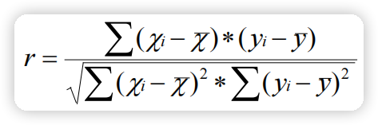
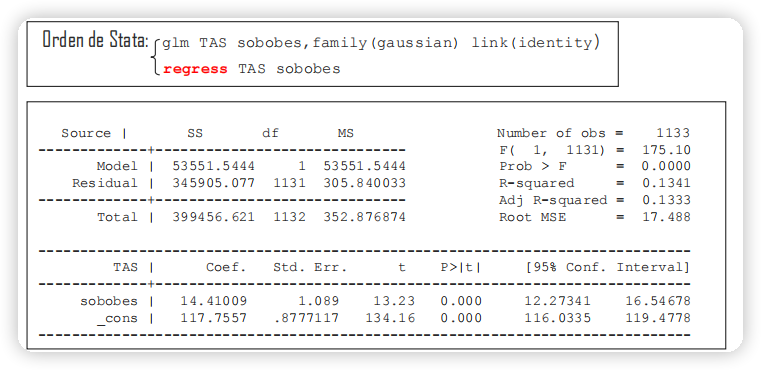
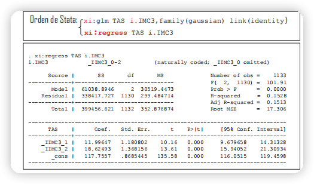
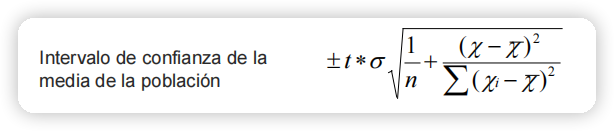
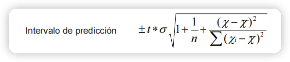
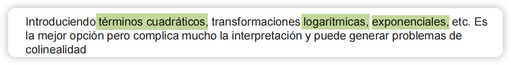

# STATA练习

* 
* tiene correlación creciente
* tiene correlación decreciente
* su valor será mayor cuando mayor sea la correlación de los puntos alrededor de la recta

* interpretación
    * Las personas con IMC >= 25 tiene en promedio un TAS de 14.4 mmHG más elevada que las que tienen IMC < 25

* F统计量的计算方式是 ==组件变异与组内变异==的比 ==cuadrados medios entre / cuadrados medios dentro==
* 
* La interpretación sobre el coeficiente 11.99 
    * Las personas con sobrepeso (IMC3 == 1) respecto a las que tienen un IMC < 25, tienen en promedio una TAS de 11.99 mmHg más elevada que los que tiene un IMC < 25
    * Las persona con obesidad (IMC3 == 2) respecto a las que tienen un IMC < 25, tienen en promedio una TAS de 18 mmHg más elevada que los que tiene un IMC < 25
    * 如果是负的
        * Las personas con IMC < 25 respecto a las que tienen un IMC > 30, tienen un promedio una TAS de ... mmHg menor que los que tienen un IMC > 30
* 
* 

## 多重线性回归

* Las principales aplicaciones son :
    * Explorar un conjunto de posibles variables explicativas
    * Elaborar un modelo predictivo de la variable respuesta 
    * Controlar los efectos de las variables de confusión
    * Detectar y describir la interacción o modificación del efecto

## 多元线性回归模型的构建

