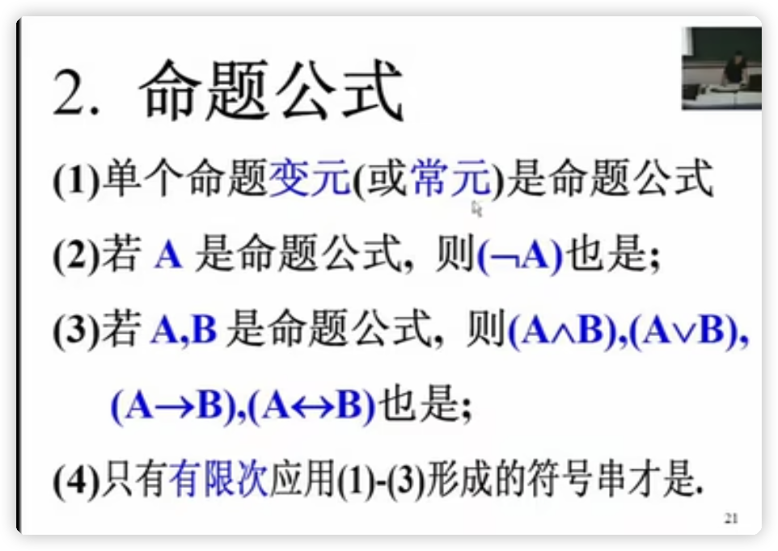
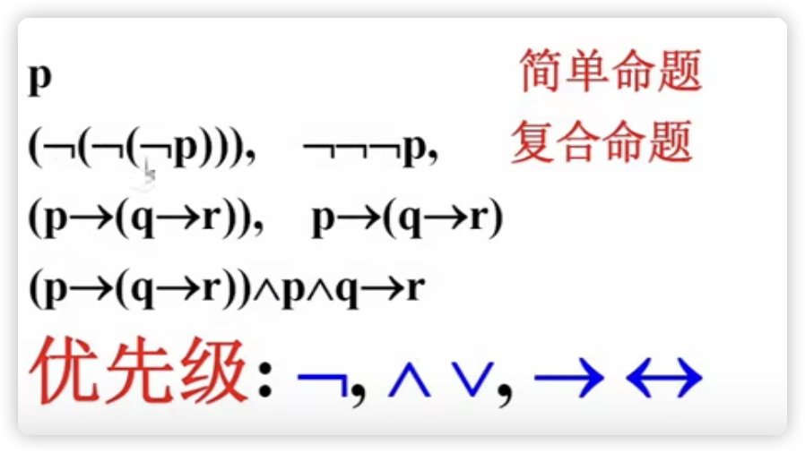
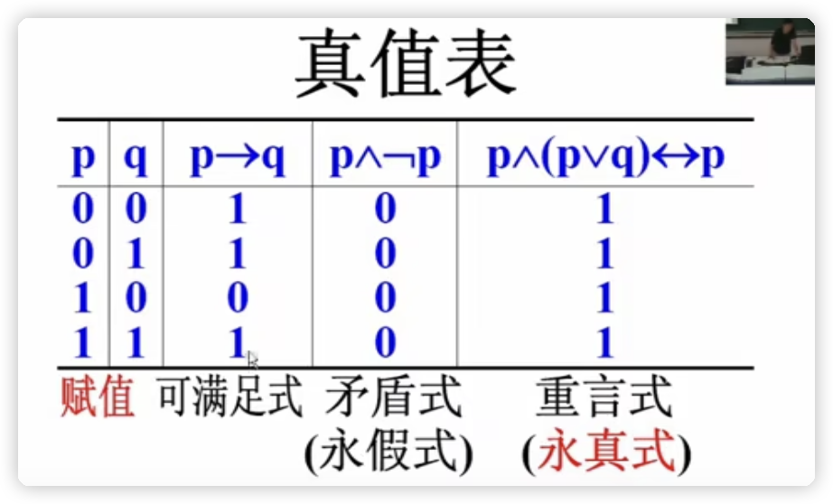
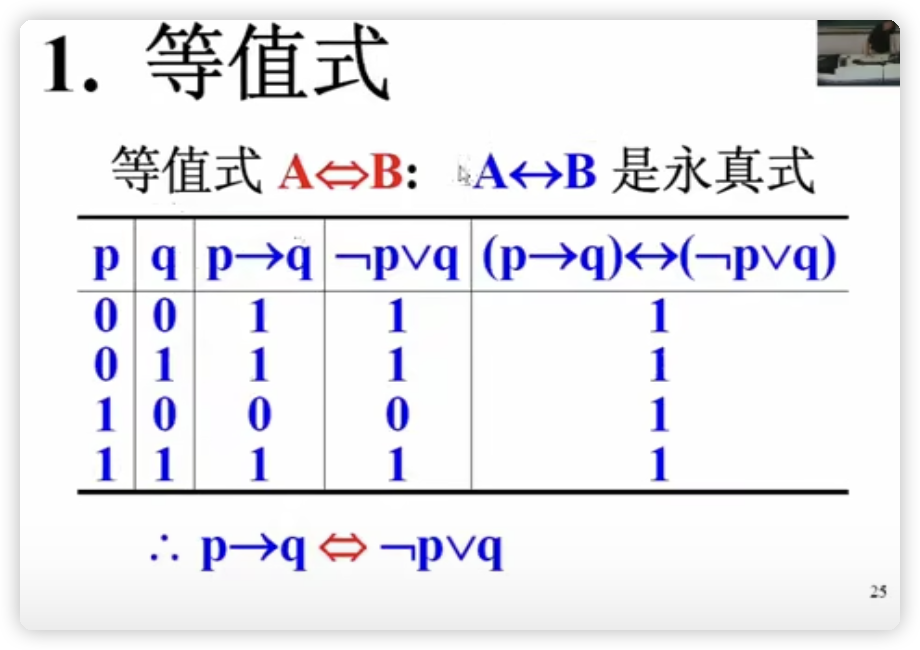

# 1. 集合

## 1.2 命题逻辑预备知识

### 联结词  p, q, r 表示 ==原子命题==(或者==简单命题==)

* 1 表示为真
* 0 表示为假

* ==¬p==称为p 的否定形式

* |  p   |  ¬p  |
    | :--: | :--: |
    |  0   |  1   |
    |  1   |  0   |

* pˆq 称为p与q的==合取式==

* |  p   |  q   | pˆq  |
    | :--: | :--: | :--: |
    |  0   |  0   |  0   |
    |  0   |  1   |  0   |
    |  1   |  0   |  0   |
    |  1   |  1   |  1   |

* pˇq 称为p与q的==析取式==

* |  p   |  q   | pˇq  |
    | :--: | :--: | :--: |
    |  0   |  0   |  0   |
    |  0   |  1   |  1   |
    |  1   |  0   |  1   |
    |  1   |  1   |  1   |

* p -> q 称为 p 与 q 的==蕴含式==

* |  p   |  q   | p->q |
    | :--: | :--: | :--: |
    |  0   |  0   |  1   |
    |  0   |  1   |  1   |
    |  1   |  0   |  0   |
    |  1   |  1   |  1   |

* p <->q 称为 p 与 q 的==等价式==

* | p    | q    | p<->q |
    | ---- | ---- | ----- |
    | 0    | 0    | 1     |
    | 0    | 1    | 0     |
    | 1    | 0    | 0     |
    | 1    | 1    | 1     |

### 命题公式

### 等值式

* 等值式 A<=>B
* 

 

